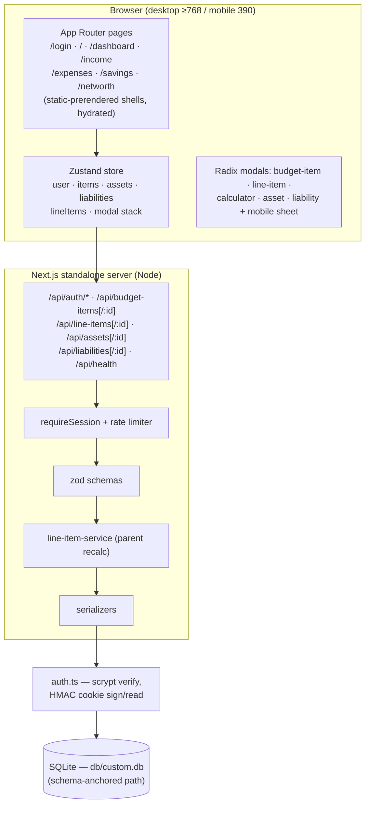
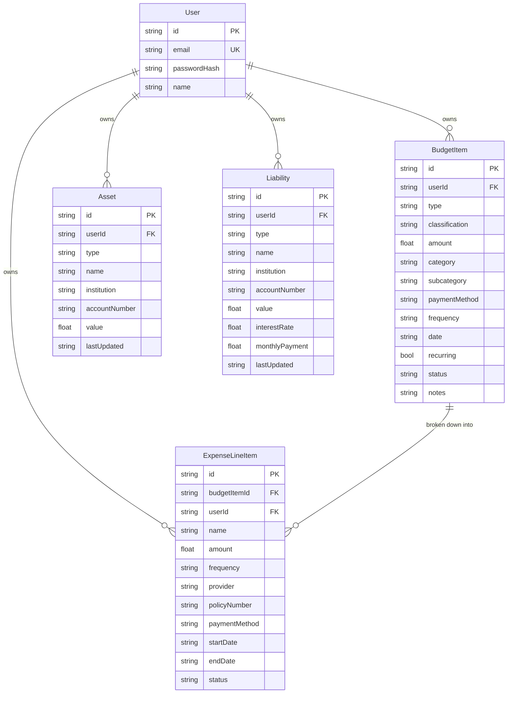

# ZeroBalance — Master Project Architecture Document (PAD) v1.0.0

**Classification:** Internal Engineering Reference
**Status:** DEFINITIVE, PRODUCTION-LOCKED BLUEPRINT
**Companion Document:** README.md (user-facing); AGENTS.md / CLAUDE.md (agent operating rules)
**Last Updated:** 2026-10-07
**Audience:** Senior Engineers, Tech Leads, DevOps, and Onboarding Engineers
**Rule:** Every architectural decision in this document traces to a specific rationale.
           Nothing is here "because it's popular."

#### Revision Block — v1.0.0 (Tracked Changes)

- `[AUTH]` v1.0.0 — the ZeroBalance application built on the repo scaffolding: all 7 routes, 15 API handlers, the Prisma schema, the three-tier test suite, and the Tailwind v4 trap mitigations. ORBITAL-era specs/scripts replaced.
- `[SR]` Both reference mobile-navigation bugs fixed and pinned by e2e (toast click-block, sheet-stays-open).
- `[SR]` zustand v5 derived-selector re-render loop (React #185) found on production build and fixed with `useShallow`.

---

## Table of Contents

1. [System Overview & Decisions](#1-system-overview--decisions)
2. [High-Level System Topology](#2-high-level-system-topology)
3. [Application Architecture](#3-application-architecture)
4. [Data Architecture](#4-data-architecture)
5. [Design System Reference](#5-design-system-reference)
6. [Security Architecture](#6-security-architecture)
7. [Testing Strategy](#7-testing-strategy)
8. [Build & Deployment](#8-build--deployment)
9. [Developer Handbook](#9-developer-handbook)
10. [Known Issues & Outstanding Tasks](#10-known-issues--outstanding-tasks)
11. [Key Files Reference](#11-key-files-reference)
12. [Glossary](#12-glossary)

---

## 1. System Overview & Decisions

### 1.1 Document Metadata & Purpose

ZeroBalance is a self-hosted budget planner and a **superset clone** of the ZeroBudget reference app (`zero-balance-4885a8f3.base44.app`): it reproduces the reference's seven routes, four entities, and measured design system, while fixing the reference's two mobile-navigation bugs and hardening the stack (validation, rate limiting, sessions, integer-cent arithmetic).

Use this PAD to understand, extend, debug, or replicate the system. New engineers: read §1–§4 first. Debugging: §6 (security), §8 (build), §10 (known issues). Reviewing tech choices: §1.3 (ADRs).

### 1.2 Technology Stack Summary

| Layer | Technology | Version | Key Rationale |
|-------|-----------|---------|---------------|
| Web framework | Next.js (App Router) | ^16.1.1 | Standalone output + static prerender of the item views; route handlers colocate the API |
| UI runtime | React | ^19.0.0 | Required by Next 16; hooks-v6 lint rules enforced |
| Language | TypeScript (strict) | ^5 | `tsc --noEmit` is a gate; no build-time escape hatches |
| Styling | Tailwind CSS | 4 | CSS-first `@theme`; parity colors done with inline styles + CSS vars (engine-independent) |
| Charts | recharts | ^3.10.1 | The reference's donut is recharts; same library = same sector geometry |
| Client state | Zustand | ^5.0.6 | One store for server data + modal stack; `useShallow` for derived selectors |
| UI primitives | Radix UI (dialog, select, dropdown, radio, toast, tabs, switch, label, popover, alert-dialog) | ^1.x/2.x | The reference is Radix-based; accessible behavior matches by construction |
| Icons | lucide-react | ^0.525.0 | The reference's icon set |
| ORM | Prisma | 6.11.1 (pinned) | Schema-first, typed client; version pinned — URL resolution behavior differs across minors |
| Database | SQLite | — | Zero-config single-file; matches the reference's deployment model |
| Validation | zod | ^4.6.5 | Field-level 400s at the API boundary; preprocessors normalize wire formats |
| Unit tests | Vitest | ^5.0.1 | Fast node-env tests for pure domain seams |
| E2E tests | Playwright | ^1.63.0 | Drives the production standalone build in real Chromium |
| Runtime | Node ≥ 20 / bun ≥ 1.2 | — | `bun` used for scripts; Node for the standalone server |

### 1.3 Architecture Decision Records (ADRs)

**ADR-001: Single Next.js application (no monorepo, no separate API service)**

- **Context:** The reference is a Base44 SPA with a generic entity API. The clone must be self-hostable with minimal moving parts, and the e2e suite must exercise the production build end-to-end.
- **Decision:** One Next.js 16 app: App Router pages for the 7 routes, route handlers for the 15 API endpoints, one Prisma client.
- **Rationale:** The deployment model is single-server SQLite; a separate API would add operational surface with zero benefit. Colocated handlers keep the envelope, validation, and serialization conventions enforceable in one place.
- **Consequences:** + simple deploys, one typecheck/lint gate. − API and UI share a release cadence (acceptable at this scale).
- **Alternatives Rejected:** Turborepo monorepo (the scandihaven lineage) — overkill for one app; separate Express/Fastify API — doubles infra.

**ADR-002: Client-side state in one Zustand store; API as the persistence seam**

- **Context:** The reference is an SPA whose views all read one client cache. Hydrated static pages + client fetches must not fight over data ownership.
- **Decision:** All server data (items/assets/liabilities/lineItems) lives in a single Zustand store; pages are thin client components; mutations go store → API → store update. No React Context, no server components fetching domain data.
- **Rationale:** Matches the reference's interaction model exactly (optimistic-free, fetch-on-boot, mutate-and-refresh), and keeps every view reactive to every mutation (the dashboard follows the calculator's parent-recalc live).
- **Consequences:** + one source of truth, simple modals. − derived selectors need `useShallow` (see ADR-006), and the first paint waits for the boot fetch.
- **Alternatives Rejected:** TanStack Query (server-cache semantics don't match the modal-driven mutation flow); Redux Toolkit (boilerplate).

**ADR-003: SQLite via a schema-anchored relative `file:` URL**

- **Context:** The repo contract is `DATABASE_URL="file:../db/custom.db"` with `db/` at the repo root. Prisma's CLI resolves relative URLs differently depending on whether the value came from `.env` (schema-dir anchored) or the shell (CWD anchored) — a real footgun that put databases in the wrong folder during this build.
- **Decision:** `src/lib/db-path.ts` implements the runtime rule: a relative `file:` URL resolves against the first anchor containing `prisma/schema.prisma` (standalone-build detection included). npm scripts pin `DATABASE_URL` for the runtime and strip it (`env -u`) for CLI commands.
- **Rationale:** One database location for `next dev`, `next build`, the standalone server, the Prisma CLI, and the seed — regardless of CWD or a polluting parent-shell export. Pinned by `tests/db-path.test.ts` (15 cases).
- **Consequences:** + reproducible DB location everywhere. − contributors must use the npm wrapper scripts, not bare `prisma` commands (documented in AGENTS.md).
- **Alternatives Rejected:** Absolute URLs in `.env` (not portable); a `datasources` override in code (hides the resolution from the CLI).

**ADR-004: Integer-cent money arithmetic behind a plain-number wire format**

- **Context:** The reference API exchanges plain JSON numbers; naive float sums drift (`0.1 + 0.2`).
- **Decision:** Amounts are stored and exchanged as user-entered decimals; **every** aggregation converts to integer cents first (`src/lib/money.ts`), then formats via `Intl` (`$5,550.00`).
- **Rationale:** API parity with the reference without inheriting its float math; totals are exact and deterministic (the e2e suite asserts them to the cent).
- **Consequences:** + exact totals; format functions are the single display authority. − the wire format permits more decimals than cents (rounded at conversion).
- **Alternatives Rejected:** Storing integer cents in the DB (breaks wire parity); decimal libraries (unnecessary at this scale).

**ADR-005: scrypt + HMAC-signed cookie sessions; no auth service**

- **Context:** Self-hosted, single-server; no external identity provider.
- **Decision:** `src/lib/auth.ts`: scrypt (N=16384) password hashing with per-user salt; HMAC-SHA256 signed session cookies (7-day expiry, constant-time compare); `AUTH_SECRET` required in production.
- **Rationale:** Zero external dependencies; the reference's cookie-session behavior (including `?from_url=` return handling and login rendering for authenticated users) is reproduced.
- **Consequences:** + auditable in ~100 lines. − per-process rate-limit state and no SSO (both acceptable for the single-server model; documented).
- **Alternatives Rejected:** NextAuth/Auth.js (needs an adapter + provider config for a local-password app); JWTs (larger, revocable only by rotation).

**ADR-006: Tailwind v4 with measured mitigations (not defaults)**

- **Context:** `docs/Tailwind-V4-Validation-Report.md` documents five v4 behavior changes that silently alter visual output (bare-HSL transparent theme, oklch palette drift, oklab gradients, `space-y` selector rewrite, shadow-scale shift). The reference also breaks mobile nav through a toast-container bug.
- **Decision:** `src/app/globals.css` pins the mitigations: `@theme` colors in hex with `inline` reference, the reference's shadow scale pinned, v4-native `w-(--var)` syntax, `h-svh` for full-height fixed chrome, and the toast viewport `pointer-events: none`. Parity colors are applied via inline styles + CSS vars.
- **Rationale:** Utility classes for layout + inline CSS-var colors reproduces the reference's computed styles engine-independently — v4's color-space conversions can't drift what isn't in the palette pipeline.
- **Consequences:** + stable computed parity, both reference nav bugs fixed and test-pinned. − two styling channels (documented convention).
- **Alternatives Rejected:** Tailwind v3 (abandons v4 perf/tooling); CSS modules (loses utility velocity).

**ADR-007: Three-tier verification with a self-resetting e2e database**

- **Context:** The parity spec asserts the seed's exact arithmetic; leftover fixtures from a failed run poison every later assertion (observed during this build).
- **Decision:** Vitest for pure seams (87), Playwright against the production standalone build (34) with `db/e2e.db` **deleted and re-seeded by global setup every run**, and a 30-step bash API smoke. E2e specs restore their own fixtures; one worker; one storageState login (auth is rate-limited 10/IP/15 min).
- **Rationale:** Deterministic runs from any working tree state; the suite can assert to-the-cent numbers forever.
- **Consequences:** + zero flake from state, real-production coverage. − e2e wall time ~45s; a spec that crashes mid-flow must be re-run (the next global setup cleans it).
- **Alternatives Rejected:** Per-test databases (slower, changes timing); API-level-only tests (miss the hydration bugs this suite caught — React #185, modal stacking).

---

## 2. High-Level System Topology



**Scaling & constraints:** single Node process, single SQLite file (WAL journaling off by default). The rate limiter is per-process memory — correct for the single-server model, swap for shared storage before horizontal scaling. Every route handler is stateless apart from the DB file and the limiter.

---

## 3. Application Architecture

### 3.1 The Layer Model

```
Layer 0: Routes (src/app/**/page.tsx) — compose AppShell + one view.
         Rule: pages never fetch; they render views.
Layer 1: Views & dialogs (src/components/budget/*) — read the store,
         dispatch store actions. Rule: no direct API calls except
         through store actions; inline styles + CSS vars for colors.
Layer 2: Store (store.ts) — the only API caller (src/lib/api.ts) and
         the only modal owner. Rule: one store; selectors returning
         derived references must use useShallow.
Layer 3: Domain seams (src/lib/*) — pure functions + the API routes'
         helpers (validation, auth, money, dashboard math, serializers,
         db-path, rate-limit). Rule: no React imports here.
Layer 4: Prisma + SQLite (prisma/schema.prisma, src/lib/db.ts) —
         typed rows only. Rule: rows cross into the API shape only
         through serializers.
```

The Golden Rule: **data flows `UI → store action → API → zod → Prisma → serializer → store update → UI`** — any shortcut around the store or the serializers is a defect.

### 3.2 Annotated Directory Structure

```
├── prisma/
│   ├── schema.prisma        # User, BudgetItem, ExpenseLineItem, Asset, Liability (+ cascade + indexes)
│   └── seed.ts              # Idempotent demo seed: 2 income / 3 expense / 2 savings items, 3 assets, 2 liabilities
├── src/
│   ├── app/
│   │   ├── api/             # 15 route handlers (auth x4, budget-items x2, line-items x2,
│   │   │                    #   assets x2, liabilities x2, health) — envelope + zod + session guard
│   │   ├── login/page.tsx   # Three-state auth card (sign-in / sign-up / forgot)
│   │   ├── page.tsx         # "/" — dashboard (dual route with /dashboard, like the reference)
│   │   └── [dashboard|income|expenses|savings|networth]/page.tsx
│   ├── components/
│   │   ├── budget/
│   │   │   ├── store.ts             # THE Zustand store: state + actions + modal stack + api client use
│   │   │   ├── app-shell.tsx        # Boots the store; sidebar + main + ModalHost (conditional mounts)
│   │   │   ├── sidebar.tsx          # 256px desktop rail + mobile header + 288px sheet (nav-close fix)
│   │   │   ├── dashboard-view.tsx   # NET ZERO hero, breakdown, stat cards, donut, guidelines, quick actions
│   │   │   ├── items-view.tsx       # Shared income/savings/expenses view (filters, cards, empty state)
│   │   │   ├── item-card.tsx        # Badges, ellipsis menu, inline Edit/Calculate (expenses), inline confirm
│   │   │   ├── net-worth-view.tsx   # Gradient summary + Assets/Liabilities tabs + cards
│   │   │   ├── budget-item-dialog.tsx   # Add/Edit item: type/classification/amount/frequency/status/…
│   │   │   ├── calculator-dialog.tsx    # Category calculator (category-adaptive chrome)
│   │   │   ├── line-item-dialog.tsx     # Nested add/edit line item (scoped close: calculator stays open)
│   │   │   ├── asset-dialog.tsx / liability-dialog.tsx
│   │   │   ├── login-card.tsx       # Reference auth card (circular logo chip, Google button, states)
│   │   │   └── require-session.tsx  # /login?from_url= redirect gate
│   │   └── ui/              # shadcn-style Radix primitives (dialog w/ sheet, select, dropdown,
│   │                        #   radio-group, toast w/ pointer-events fix, tabs, switch, input, …)
│   └── lib/
│       ├── api.ts           # Typed fetch client + ApiError (the only direct fetch)
│       ├── api-helpers.ts   # ok/fail envelope, parseBody, requireSession
│       ├── auth.ts          # scrypt hash/verify, HMAC cookie sessions, session user resolution
│       ├── constants.ts     # Domain enums, labels, measured palette (single source of truth)
│       ├── dashboard.ts     # computeTotals, goalStatus, spendingBreakdown, computeNetWorth
│       ├── db.ts / db-path.ts  # Prisma client + the schema-anchored URL resolution contract
│       ├── line-item-service.ts # Parent recalculation rule (sum of line items, server-side)
│       ├── money.ts         # Integer-cent arithmetic + formatters ($, +/−, ∞ ratio, %)
│       ├── rate-limit.ts    # Fixed-window limiter (10/15min) + clientIp
│       ├── serializers.ts   # Prisma row → API payload (ISO dates, null → undefined, no userId)
│       ├── types.ts         # Client-facing domain types (mirror the API payloads)
│       └── validation.ts    # Every zod schema (incl. optionalIsoDate "" normalizer)
├── tests/
│   ├── *.test.ts            # Vitest unit suites (money, dashboard-math, validation, rate-limit,
│   │                        #   constants, serializers, line-item-service, db-path)
│   └── e2e/                 # Playwright: auth, dashboard, items, calculator, networth,
│                            #   mobile-navigation (+ auth.setup, global-setup, helpers)
├── scripts/
│   ├── smoke-test.sh        # 30-step production API smoke (own server on :3210)
│   └── capture-screenshots.mjs  # docs/screenshots generator (boots its own standalone server)
├── docs/                    # Tailwind v4 report, SSH push runbook + wrapper, DEPLOYMENT.md
└── db/custom.db             # SQLite database (gitignored; e2e.db alongside during runs)
```

### 3.3 Critical Code Patterns

**Pattern 1 — Integer-cent aggregation (the arithmetic seam)**

```ts
// src/lib/money.ts — every total in the app runs through this seam so
// IEEE-754 drift (0.1 + 0.2) can never reach a displayed amount.
export function sumAmounts(amounts: number[]): number {
  return fromCents(amounts.reduce((acc, a) => acc + toCents(a), 0));
}
```

*Why this pattern:* the wire format is plain numbers (reference parity), but totals must be exact — the e2e suite asserts `+$2,065.00` computed from seven seeded decimals. Centralizing the conversion means no view can accidentally sum floats.

**Pattern 2 — useShallow on derived Zustand selectors**

```tsx
// src/components/budget/items-view.tsx — without useShallow the selector
// returns a NEW array on every snapshot call; zustand v5's
// useSyncExternalStore then sees a changed snapshot every render and
// loops to "Maximum update depth exceeded" (React #185) on the hydrated
// static pages. useShallow returns the previous reference when the
// elements are shallow-equal.
const items = useBudgetStore(
  useShallow((s) => s.items.filter((i) => i.type === type)),
);
```

*Why this pattern:* the bug only manifested in the production build (hydration timing), not in `next dev` — it reached the e2e suite and crashed all three item views. Every future derived selector must follow this form.

**Pattern 3 — Store-driven modals with lazy form initialization**

```tsx
// src/components/budget/budget-item-dialog.tsx — the ModalHost only
// mounts this dialog while a modal is open, so every open is a fresh
// mount: the form derives from the modal AT MOUNT (lazy initializer) and
// re-derives if the modal identity ever changes in place
// (adjust-state-during-render — no effects, no cascading renders).
const [form, setForm] = React.useState<BudgetItemFormData>(() => initialForm(modal));
const modalKey = modal
  ? modal.mode === "edit" ? `edit:${modal.item.id}` : `create:${modal.type}`
  : null;
const [resetKey, setResetKey] = React.useState(modalKey);
if (resetKey !== modalKey) { setResetKey(modalKey); setForm(initialForm(modal)); }
```

*Why this pattern:* an earlier effect-based reset silently never fired (the component mounted with the modal already set), leaving create-forms at their defaults; the lazy initializer makes initialization structural rather than timing-dependent, and satisfies `react-hooks/set-state-in-effect`.

**Pattern 4 — Modal panel stacking (clicks must land)**

```css
/* src/app/globals.css — the panel is fixed + centered ABOVE the z-50
   overlay. A static panel would paint below the fixed overlay: visible
   through its translucency but unclickable (the overlay intercepted
   every pointer event). Same z-index as the overlay, later in the DOM
   → stacked on top. */
.zb-modal-panel {
  position: fixed; z-index: 50;
  left: 50%; top: 50%; transform: translate(-50%, -50%);
  width: calc(100% - 2rem); max-width: 42rem; max-height: 90vh; overflow-y: auto;
}
```

*Why this pattern:* the dialog built-in Close button additionally needs `z-20` — the sticky dialog header creates a `z-10` stacking context that otherwise buries it. Both lessons are e2e-pinned.

**Pattern 5 — Server-side parent recalculation (calculator rule)**

```ts
// src/lib/line-item-service.ts — creating/editing/deleting a line item
// recalculates and persists the parent BudgetItem's amount as the sum of
// its line items. The response carries { lineItem, parentAmount } so the
// store can update the parent in place — the dashboard follows live.
export async function recalcParentAmount(budgetItemId: string) {
  const lineItems = await db.expenseLineItem.findMany({
    where: { budgetItemId }, select: { amount: true },
  });
  const total = sumAmounts(lineItems.map((li) => li.amount));
  return db.budgetItem.update({ where: { id: budgetItemId }, data: { amount: total } });
}
```

*Why this pattern:* the reference recalculates the category total immediately (no client save step); reproducing the rule server-side keeps every client consistent and makes the recalc testable through the real API.

*(Additional pinned patterns: the toast viewport `pointer-events: none` fix — `src/components/ui/toast.tsx`; the schema-anchored `file:` URL resolution — `src/lib/db-path.ts`, with the standalone-build CWD detector; the mobile sheet's pathname-driven close — `src/components/budget/sidebar.tsx`.)*

---

## 4. Data Architecture

### 4.1 Database Schema



**Enum-string columns** (`type`, `classification`, `frequency`, `status`) are validated at the API boundary by zod (`src/lib/validation.ts` mirrors `src/lib/constants.ts`) — SQLite has no native enums. Indexes: `@@index([userId, type])` and `@@index([userId, createdAt])` on BudgetItem back the list views. Deletes cascade (`onDelete: Cascade`) so a deleted user (or budget item) takes its children with it.

### 4.2 Data Models

The client-facing types (`src/lib/types.ts`) mirror the API payloads exactly (camelCase, optional nulls as `| undefined`): `BudgetItem`, `ExpenseLineItem`, `Asset`, `Liability`, plus form-data variants. Prisma rows never reach a component — `src/lib/serializers.ts` is the only translator (ISO timestamps, `null → undefined` elision, `userId` never serialized).

### 4.3 Persistence Strategy

- **Connection model:** one `PrismaClient` per process (`src/lib/db.ts`), instantiated with the schema-anchored URL. SQLite file locking means a single server process — the intended deployment.
- **Migrations:** `prisma db push` during development (schema-first, no migration history); `prisma migrate dev` available for hosted environments (`npm run db:migrate`).
- **Seed:** `prisma/seed.ts` is idempotent (upserts the user; reuses items by natural keys `type+category+subcategory`) and safe to re-run — the e2e global setup relies on exactly that property after deleting the file.
- **Backup:** the database is one file (`db/custom.db`) — copy it offline; there is no WAL sidecar in normal operation.

---

## 5. Design System Reference

### 5.1 Typographic System

The reference uses the **system font stack** (`ui-sans-serif, system-ui, sans-serif, …`) — no webfonts, zero font loading. Hierarchy is by weight and size only: `text-3xl font-bold` page titles (forest-dark), `text-sm font-medium gray` card labels, `text-xs font-semibold uppercase tracking-wider` group labels, `text-2xl/3xl font-bold` amounts.

### 5.2 Color Tokens

Measured from the reference's `:root` (computed styles as ground truth); canonical definitions in `src/lib/constants.ts` (`COLORS`, `rgb`, `TYPE_COLORS`):

| Token | Hex / rgb | Usage |
|-------|-----------|-------|
| `--forest-dark` | `#1a3a2e` / `rgb(26,58,46)` | Headings, hero gradient start, modal titles |
| `--forest-medium` | `#2d5a4a` / `rgb(45,90,74)` | Active-nav gradient start, secondary text |
| `--lime-green` | `#8fbc3f` / `rgb(143,188,63)` | Income accent, primary buttons, avatar, "Savings" donut slice |
| `--lime-light` | `#b8d87e` | (supporting) |
| `--orange-dark` | `#e07a3b` / `rgb(224,122,59)` | Expense accent, "Need" slice, hero allocation gradient |
| `--orange-light` | `#f5a962` | Goal-card status text |
| `--blue-dark` / `--blue-medium` | `#2c5f7c` / `#3b7ea1` | Savings accent ("Want" slice `#3b7ea1`) |
| `--neutral-warm` | `#fafaf8` | Page background |
| (non-var) | `rgb(229,231,227)` | Borders/dividers |
| (non-var) | `rgb(107,114,128)` | Secondary gray text |
| (non-var) | `rgb(245,248,245)` | Sidebar footer / legend chip tint |
| Icon tints | `rgba(accent, 0.125)` | Card/empty-state icon squares |

**Application rule:** Tailwind utilities for layout/spacing; **inline styles + CSS vars for colors** on parity surfaces — computed-style parity independent of the engine's color-space conversions (ADR-006).

### 5.3 Component Primitives

shadcn-style Radix primitives in `src/components/ui/` (dialog with left/right `SheetContent`, select, dropdown-menu, radio-group, toast, tabs, switch, input, label, textarea, badge, button, alert-dialog, popover), styled to the reference's measured geometry (256px rail `h-svh`, 288px sheet `w-(--sheet-width)` with `h-svh`, sticky `z-10` modal headers with `z-20` close buttons, `max-w-2xl`/`42rem` panels, `max-h-[90vh]` scroll).

### 5.4 Motion / Animation

Radix `data-[state]`-driven: sheet slide-in 500ms / slide-out 300ms with fade; modals without entrance animation (matching the reference); toast slide-in top (mobile) / bottom-right (sm+) with 4s duration and swipe-dismiss. Donut entrance animation is recharts' default. No reduced-motion handling beyond Radix defaults (no custom keyframes to degrade).

---

## 6. Security Architecture

### 6.1 Security Rules

| Rule | Enforcement |
|------|-------------|
| Every API input is validated | `parseBody(schema)` in every handler — zod rejects with field-level 400s |
| Sessions are signed, not encrypted-but-trusted | HMAC-SHA256 over `userId.expiry`, constant-time compare in `auth.ts` |
| Passwords are salted + slow-hashed | scrypt (N=16384, 64-byte), per-user random salt — never reversible |
| Auth endpoints are rate-limited | `authLimiter` 10 attempts / 15 min / IP → 429 + `Retry-After` |
| No account enumeration | Unknown email and wrong password both → 401 `"Invalid email or password"` |
| Rows are user-scoped | Every query filters `userId` from the session (`requireSession`) |
| Secrets never enter the tree | `.gitignore` rejects `.env`, `*.key`, `ssh-key.txt`; push keys live outside the repo (SSH wrapper runbook) |
| No `userId` leaks in payloads | Serializers are the only row→payload translator |
| `AUTH_SECRET` required in production | Boot warns loudly; generate with `openssl rand -hex 32` |

### 6.2 Security Utilities

`src/lib/auth.ts` (hash/verify/session sign+read), `src/lib/rate-limit.ts` (fixed-window limiter, pure + unit-tested; `clientIp` prefers `x-forwarded-for`'s first hop), `src/lib/api-helpers.ts` (`requireSession` guard), `src/lib/validation.ts` (all schemas, including the empty-string date normalizer and the real-calendar-date check).

### 6.3 Authentication & Authorization

Single-role model: a signed-in user owns every row they create. Session cookie (`zb_session`): `userId.exiryTs` HMAC-signed, `httpOnly`, `sameSite=lax`, 7-day expiry, set on login/register, cleared on logout. Client boot (`store.boot()`) resolves `/api/auth/me`; `RequireSession` redirects unauthenticated workspace visits to `/login?from_url=<path>` (the reference's return-URL behavior), and the login card renders for authenticated users too (reference parity — re-sign-in lands on the workspace).

### 6.4 Threat Model

| Vector | Mitigation |
|--------|-----------|
| Credential stuffing | Rate limiting (10/15min/IP) + identical 401s for unknown email / wrong password |
| Session forgery | HMAC signature + constant-time verification; secret required in prod |
| Session fixation | Fresh cookie value on every login |
| SQL injection | Prisma parameterized queries only — no raw SQL anywhere |
| XSS | React escaping; no `dangerouslySetInnerHTML`; cookies `httpOnly` |
| CSRF on mutations | `sameSite=lax` cookies + JSON-only bodies (cross-site form posts can't produce JSON content-type without CORS preflight) |
| Click-blocking overlay UI hijack | Toast viewport `pointer-events: none` (the reference's bug — fixed here) |
| Secret leakage via git | `.gitignore` + wrapper-based SSH pushes; keys shredded after use |

---

## 7. Testing Strategy

### 7.1 Test Distribution

| Category | Files | Tests | Location | Framework |
|----------|-------|-------|----------|-----------|
| Unit — money math | 1 | 17 | `tests/money.test.ts` | Vitest |
| Unit — dashboard aggregations | 1 | 9 | `tests/dashboard-math.test.ts` | Vitest |
| Unit — zod schemas | 1 | 18 | `tests/validation.test.ts` | Vitest |
| Unit — rate limiter | 1 | 8 | `tests/rate-limit.test.ts` | Vitest |
| Unit — domain constants | 1 | 5 | `tests/constants.test.ts` | Vitest |
| Unit — serializers | 1 | 5 | `tests/serializers.test.ts` | Vitest |
| Unit — line-item rule | 1 | 4 | `tests/line-item-service.test.ts` | Vitest |
| Unit — db-path contract | 1 | 15+ | `tests/db-path.test.ts` | Vitest |
| E2E — auth | 1 | 6 | `tests/e2e/auth.spec.ts` | Playwright |
| E2E — dashboard | 1 | 7 | `tests/e2e/dashboard.spec.ts` | Playwright |
| E2E — item views + CRUD | 1 | 8 | `tests/e2e/items.spec.ts` | Playwright |
| E2E — calculator | 1 | 3 | `tests/e2e/calculator.spec.ts` | Playwright |
| E2E — net worth | 1 | 4 | `tests/e2e/networth.spec.ts` | Playwright |
| E2E — mobile + desktop nav | 1 | 6 | `tests/e2e/mobile-navigation.spec.ts` | Playwright |
| Smoke — production API | 1 script | 30 steps | `scripts/smoke-test.sh` | bash + curl |

### 7.2 Test Patterns

- **Unit tests target pure seams only** — money, dashboard math, validators, limiter, serializers — with the reference's own numbers as fixtures (the seed arithmetic: income 5550 / savings 1250 / expenses 2235 → `+$2,065.00`, allocation 62.8%, need 81.6% / want 4.6% / savings 13.8%).
- **E2E drives the production standalone build** (`playwright.config.ts` webServer → `bun .next/standalone/server.js` on :3100 with `db/e2e.db`), signing in once via the `setup` project and replaying `storageState` — never per-test logins (rate-limit budget).
- **Global setup wipes and re-seeds the e2e database every run**; specs restore their own fixtures (delete created items; restore edited amounts through the real edit flow) because the suite shares one file in one worker.
- **Both superset fixes have dedicated specs**: the hamburger is clicked for real (a covering overlay would fail the hit-test) and every nav link's tap asserts the sheet closes.

### 7.3 Coverage Thresholds

No numeric coverage gate is configured; the standard is **every bug fixed gets a test that would have caught it** (all six engineering fixes in this build did), and every parity number asserted to the cent.

### 7.4 Pre-PR / Pre-Deploy Checklist

- [ ] `npm run lint` — zero errors (react-hooks v6 rules included)
- [ ] `npm run typecheck` — clean
- [ ] `npm test` — all unit suites green
- [ ] `npm run build` — standalone output builds
- [ ] `npm run test:e2e` — all specs green (run after the build)
- [ ] `bash scripts/smoke-test.sh` — 30/30 (pre-deploy)
- [ ] No secrets, `db/*.db`, `test-results/`, or `.auth/` staged

---

## 8. Build & Deployment

### 8.1 Production Build

```bash
npm run build   # next build (pins DATABASE_URL) + standalone assembly
                #   → .next/standalone/server.js (+ static/ + public/ copies)
npm start       # NODE_ENV=production, DATABASE_URL pinned, bun server.js
```

Static shells for the 7 routes are prerendered at build time; API routes are dynamic. The runtime resolves the schema-anchored `file:` URL (the standalone CWD is detected and mapped back to the repo root by `db-path.ts`).

### 8.2 Environment Variables

| Name | Required | Description | Default |
|------|----------|-------------|---------|
| `DATABASE_URL` | yes | SQLite location; relative values anchor to `prisma/schema.prisma`. Use an **absolute** path in production. | `file:../db/custom.db` |
| `AUTH_SECRET` | prod | HMAC key for session cookies (`openssl rand -hex 32`) | insecure dev constant + loud warning |
| `NEXT_PUBLIC_SITE_URL` | no | Canonical origin for metadata | `http://localhost:3000` |
| `PORT` / `HOSTNAME` | no | Standalone server bind | `3000` / `0.0.0.0` |

### 8.3 Docker Configuration

Not shipped (single-file SQLite + Node is the deployment model); `docs/DEPLOYMENT.md` documents the bare-metal flow. A container image would only need Node 20+, the standalone folder, `public/`, `.next/static`, and an absolute `DATABASE_URL` volume mount.

### 8.4 CI/CD Pipeline

No hosted CI — the local clean-check gate (`lint → typecheck → test → build → test:e2e`, plus the smoke script pre-deploy) is the only gate, enforced by convention in AGENTS.md/CLAUDE.md. Pushes go to `main` only, via the SSH wrapper runbook (`docs/ssh_git_wrapper_v3.py` + `docs/how-to-git-push-using-ssh-wrapper_SKILL.md`) with post-push remote verification.

---

## 9. Developer Handbook

### 9.1 Local Setup

```bash
npm install
npm run db:push     # db/custom.db
npm run db:seed     # demo@zerobalance.app / Demo1234!
npm run dev         # http://localhost:3000
```

Full check: `npm run lint && npm run typecheck && npm test && npm run build && npm run test:e2e`.

### 9.2 Common Commands

| Command | Location | Purpose |
|---------|----------|---------|
| `npm run dev` / `build` / `start` | package.json | Dev server / standalone build / prod boot |
| `npm run db:push · db:seed · db:migrate · db:reset` | package.json | Prisma CLI through wrappers (`env -u` discipline) |
| `npm test` / `test:watch` / `test:e2e` | package.json | Vitest once / watch / Playwright |
| `bash scripts/smoke-test.sh` | scripts/ | 30-step production API smoke (:3210) |
| `node scripts/capture-screenshots.mjs` | scripts/ | Regenerate `docs/screenshots/` (needs a build) |
| `python3 docs/ssh_git_wrapper_v3.py --key-file … --remote git@github.com:nordeim/zero-balance.git` | docs/ | Verified push (runbook in docs/) |

### 9.3 Code Style Rules

Strict TypeScript; ESLint 9 flat config with `eslint-config-next` and react-hooks v6 (no `set-state-in-effect`, no components created during render); no formatter config (style is enforced by review); money through `src/lib/money.ts`; colors through the constants + inline CSS vars; every new enum value added to `src/lib/constants.ts` and mirrored in `src/lib/validation.ts` + `tests/constants.test.ts`.

### 9.4 Git Workflow

`main` only; Conventional Commits; atomic commits; the clean-check gate before every push; pushes through the SSH wrapper (key materialized to a 0600 temp file outside the repo, shredded after); never commit `.env`, `db/*.db`, test artifacts, or the ssh shim.

---

## 10. Known Issues & Outstanding Tasks

| Priority | Issue | Impact | Status |
|----------|-------|--------|--------|
| LOW | Rate-limiter state is per-process | A multi-instance deploy would need shared storage | Documented (ADR-005); acceptable for the single-server model |
| LOW | `isMobile` emulation quirk: percentage heights resolve against the large viewport | Sheets must use `h-svh` (they do) | Mitigated + test-pinned |
| LOW | Radix Select click immediately after a state-changing dialog interaction can land on a stale node | A dropdown may not open if clicked mid-re-render (user-perceived: click again) | Mitigated in specs with a settle-wait; framework-level behavior |
| LOW | No hosted CI | The local gate is the only gate | By design for this repo; documented |

---

## 11. Key Files Reference

| File | Lines | Purpose |
|------|-------|---------|
| `src/components/budget/store.ts` | ~281 | The Zustand store: state, actions, modal stack — the app's client heart |
| `src/components/budget/dashboard-view.tsx` | ~554 | Hero, breakdown, stat cards, donut, guidelines, quick actions |
| `src/components/budget/budget-item-dialog.tsx` | ~309 | Add/Edit budget item (lazy form init pattern) |
| `src/components/budget/net-worth-view.tsx` | ~420 | Net-worth summary + assets/liabilities tabs and cards |
| `src/components/budget/login-card.tsx` | ~303 | Three-state reference auth card |
| `src/components/budget/items-view.tsx` | ~236 | Shared item views (useShallow pattern) |
| `src/components/budget/calculator-dialog.tsx` | ~224 | Category calculator (category-adaptive chrome) |
| `src/components/budget/sidebar.tsx` | ~212 | Desktop rail + mobile header/sheet (both superset fixes) |
| `src/lib/validation.ts` | ~186 | Every zod schema (boundary contract) |
| `src/lib/constants.ts` | ~118 | Enums, labels, measured palette — single source of truth |
| `src/lib/db-path.ts` | ~107 | Schema-anchored SQLite URL resolution (15-test contract) |
| `src/lib/auth.ts` | ~104 | scrypt + HMAC cookie sessions |
| `src/lib/dashboard.ts` | ~92 | Dashboard/net-worth aggregations (pure) |
| `src/lib/serializers.ts` | ~81 | Row → payload translation |
| `src/lib/money.ts` | ~66 | Integer-cent arithmetic + formatters |
| `src/lib/rate-limit.ts` | ~63 | Fixed-window limiter + clientIp |
| `src/lib/line-item-service.ts` | ~28 | Parent recalculation rule |
| `prisma/schema.prisma` | ~120 | Five models, cascades, indexes |
| `prisma/seed.ts` | ~234 | Idempotent demo seed (the e2e fixture) |
| `src/app/globals.css` | ~214 | Tailwind v4 `@theme` + all trap mitigations |
| `tests/e2e/mobile-navigation.spec.ts` | — | Both superset fixes pinned |
| `scripts/smoke-test.sh` | — | 30-step production API smoke |

---

## 12. Glossary

| Term | Definition |
|------|------------|
| **Net zero (rule)** | The budgeting identity `Income = Savings + Expenses`; the hero card's goal state |
| **Net Balance** | `income − savings − expenses`; displayed with an explicit `+`/`−` prefix |
| **Allocation %** | `(savings + expenses) / income × 100` — the hero's progress bar (one decimal) |
| **Budget item** | One income / savings / expense entry (type, classification, amount, frequency, status…) |
| **Classification** | `need` / `want` / `savings` — drives the donut slices and badge colors |
| **Line item** | A sub-entry of an expense category (calculator); the parent's amount is the sum of its line items |
| **Category Calculator** | The category-adaptive dialog ("Rent Calculator / Break down your rent…") managing line items |
| **Superset (fix)** | A reference bug fixed in the clone — behavior the reference lacks, pinned by tests |
| **Schema-anchored URL** | A relative `file:` SQLite URL resolved against `prisma/schema.prisma` (not the CWD) |
| **Schema anchor** | The first directory containing `prisma/schema.prisma` from the candidate roots (source tree, standalone build's repo, CWD) |
| **StorageState** | Playwright's saved auth context; the e2e suite replays one login to respect the rate limiter |
