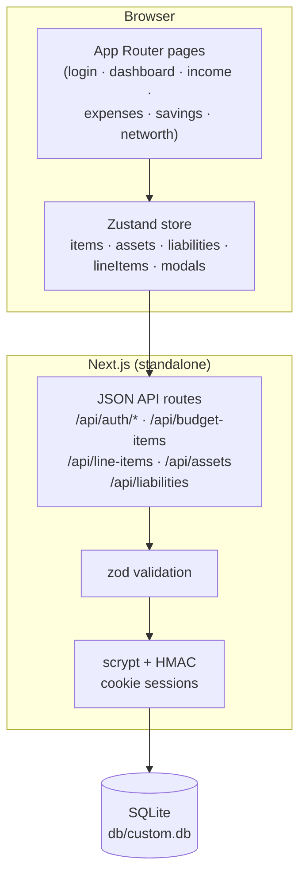
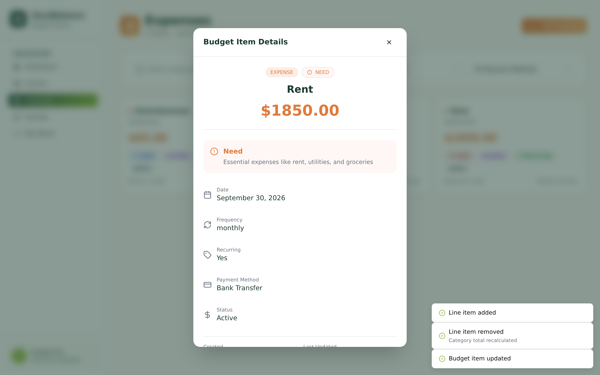

# ZeroBalance — Budget Planner


A production-grade budget planner built around one rule — **Income = Savings + Expenses** — and a self-hosted, superset clone of the reference ZeroBudget app (`zero-balance-4885a8f3.base44.app`), rebuilt as a single Next.js application with cookie-session auth, a Prisma/SQLite store, and a full three-tier test suite.

## Overview

ZeroBalance tracks income, savings, and expenses as budget items, computes your net position against the net-zero goal in real time, and breaks your balance sheet into assets and liabilities for net-worth tracking. The dashboard aggregates everything into allocation percentages, a needs/wants/savings donut, and 50/30/20 guideline rows; every expense category can be decomposed into line items through a built-in calculator that recalculates the category total server-side on every change. The clone keeps pixel-level visual parity with the reference while fixing its two mobile navigation bugs (see [Superset fixes](#superset-fixes-over-the-reference)).

## Key Features

| Feature | Description |
|---------|-------------|
| 🎯 **Net Zero Goal hero** | Forest-gradient dashboard card computing `Income − Savings − Expenses`, allocation %, and Under Budget / NET ZERO / Over Budget status |
| 📊 **Net Zero Breakdown** | A 3-level expandable drill-down (section → category → subcategory → item, accordion-style) with sign-prefixed rows (`$5,550.00` → plain format `- $1250.00`) and a sign-conditional Net Balance (lime/orange/blue) |
| 📈 **Spending Breakdown donut** | recharts pie in the reference's sector order [Savings, Want, Need] (`#8fbc3f` / `#3b7ea1` / `#e07a3b`) with piggy-bank / heart / circle-alert legend icons |
| 🧮 **Category Calculator** | Break any expense category into line items (name, amount, frequency, provider, policy #); each mutation recalculates and persists the parent item's amount server-side, with category-adaptive chrome ("Rent Calculator / Break down your rent…") |
| 💰 **Net Worth tracker** | Assets vs liabilities tabs grouped **by type** under capitalize headers, gradient summary card with the `0.21:1` / `∞:1` asset-to-liability ratio |
| 🔍 **Filterable item views** | Search + category + frequency (+ payment method on expenses) filters; per-classification/per-frequency badge maps, capitalized green Recurring badge; hover-revealed Edit/Calculate buttons on expense cards (plus a superset delete in the edit dialog) |
| 📱 **Working mobile navigation** | Hamburger + slide-in sheet at 288px with the current route highlighted (the reference's forest-gradient active style) — plus both reference bugs fixed (below) |
| 🔐 **Cookie-session auth** | scrypt password hashing + HMAC-signed sessions, per-IP rate limiting (10 attempts / 15 min), zod-validated API, four-state login card (sign-in / sign-up / forgot / verify-email) with the register flow gated behind a 6-digit email-verification code (honest self-hosted delivery — see the v21 plan) |

### Superset fixes over the reference

The live reference app has quirks and bugs, measured against the clone:

1. **Hamburger click-block** — the reference's empty toast container (`pointer-events: auto`, full-width, top 32px, z-100) covers the top half of the mobile hamburger button. The clone's toast viewport is `pointer-events: none` (the sonner pattern); toasts re-enable pointer events individually. Pinned by `tests/e2e/mobile-navigation.spec.ts`.
2. **Menu stays open after nav** — tapping a nav link in the reference's sheet changes the route but leaves the sheet + overlay trapping the user. The clone closes the sheet on every navigation. Pinned by the same spec.
3. **Root URL nav highlight** — the reference marks NO nav item active when you sit on `/` after login (its active check compares the pathname to `/dashboard`). The clone highlights Dashboard on the root route — the page you are actually viewing.
4. **Mobile horizontal overflow** — the reference's own pages scroll sideways on a 390px phone: the dashboard measures 395px and the net-worth page 464px (its fixed `text-5xl` net figure + fixed 2-col summary grid stretch `main` past the viewport). The clone fits exactly (390px) via `min-w-0` on `main` plus a responsive summary card (`text-2xl` on phones, `sm:grid-cols-2`). Pinned by `tests/e2e/mobile-layout.spec.ts` + the net-worth mobile spec.
5. **Dialogs ignore Escape AND outside-click** — the reference's modal overlays are plain `fixed` divs with no keyboard dismissal and no overlay-click dismissal (verified on its budget-item and line-item dialogs: Escape with focus inside and real clicks on the overlay corner both leave it up; only X/Cancel close it). The clone's Radix dialogs close on Escape and overlay click. Pinned by `tests/e2e/dialog-buttons.spec.ts`.
6. **Delete without confirmation** — the reference's card menu Delete destroys the item immediately (verified live — the same for its calculator line-item rows). The clone's delete paths confirm first (the edit dialog's inline confirm / the alert dialog).

The mobile layout itself (top bar stacked inside `main` at the reference's 61px geometry, no horizontal overflow) is pinned by `tests/e2e/mobile-layout.spec.ts`.

## Architecture

| Layer | Technology | Version | Purpose |
|-------|-----------|---------|---------|
| Web framework | Next.js (App Router) | ^16.1.1 | Routes, static prerender + standalone build |
| UI runtime | React | ^19.0.0 | Client components, hydrated static pages |
| Language | TypeScript (strict) | ^5 | End-to-end typing, `noEmit` typecheck gate |
| Styling | Tailwind CSS | 4 | CSS-first `@theme`, utility classes + inline CSS-var colors |
| Charts | recharts | ^3.10.1 | Spending Breakdown donut |
| State | Zustand | ^5.0.6 | Single client store (server data + modals), `useShallow` selectors |
| ORM | Prisma | 6.11.1 | Schema, migrations, typed client |
| Database | SQLite | — | `db/custom.db` at the repo root (zero-config) |
| Validation | zod | ^4.6.5 | Every API input, field-level 400s |
| Unit tests | Vitest | ^5.0.1 | Pure domain seams (money, dashboard math, validators) |
| E2E tests | Playwright | ^1.63.0 | Production standalone server, real Chromium |



## File Hierarchy

```
📂 zero-balance/
├── 📂 prisma/
│   └── 📄 schema.prisma           # User, BudgetItem, ExpenseLineItem, Asset, Liability
│   └── 📄 seed.ts                 # Idempotent demo seed (demo@zerobalance.app / Demo1234!)
├── 📂 src/
│   ├── 📂 app/                    # App Router: 7 routes + 21 API handlers (13 files)
│   │   ├── 📄 login/page.tsx      # Three-state auth card
│   │   └── 📄 [dashboard·income·expenses·savings·networth]/page.tsx
│   ├── 📂 components/
│   │   ├── 📂 budget/             # Views, dialogs, sidebar, store (the app)
│   │   └── 📂 ui/                 # shadcn-style primitives (dialog, select, toast…)
│   └── 📂 lib/                    # Domain seams: money, dashboard, validation,
│                                  #   auth, rate-limit, serializers, db-path
├── 📂 tests/
│   ├── 📄 *.test.ts               # Vitest unit suites (108 tests)
│   └── 📂 e2e/                    # Playwright specs (171 tests) + global setup
├── 📂 scripts/
│   ├── 📄 smoke-test.sh           # 35-step production API smoke test
│   └── 📄 capture-screenshots.mjs # docs/screenshots generator
├── 📄 docs/                       # Tailwind v4 report, SSH push runbook, DEPLOYMENT.md, remediation plan, session log
└── 📄 db/custom.db                # SQLite database (gitignored)
```

## Quick Start

Requires **Node.js ≥ 20** (or bun ≥ 1.2) and npm.

```bash
# 1. install
npm install

# 2. database (SQLite file at db/custom.db — created by the push)
npm run db:push

# 3. seed the demo workspace
npm run db:seed

# 4. dev server → http://localhost:3000
npm run dev
```

**Verify setup**

```bash
curl -s http://localhost:3000/api/health          # {"ok":true,...}
# then log in with the seeded demo account:
#   email: demo@zerobalance.app    password: Demo1234!
```

**Production build**

```bash
npm run build        # standalone output (pins DATABASE_URL for the build)
npm start            # boots .next/standalone/server.js
```

## Environment Variables

`.env` (see `.env.example`; `.env` is gitignored):

| Variable | Required | Description |
|----------|----------|-------------|
| `DATABASE_URL` | yes | `file:../db/custom.db` — **relative to `prisma/schema.prisma`**, not the CWD. `src/lib/db-path.ts` anchors the same rule at runtime so CLI and server agree. |
| `NEXT_PUBLIC_SITE_URL` | no | Canonical public origin for metadata, `sitemap.xml` and `robots.txt` (default `http://localhost:3000`). |
| `AUTH_SECRET` | prod | HMAC key for session cookies. Generate with `openssl rand -hex 32`. Falls back to an insecure dev constant when unset. |

> **Database-location gotcha:** Prisma resolves a relative `file:` URL from a shell-inherited `DATABASE_URL` against the **CWD**, but from a `.env`-loaded value against the **schema dir**. The npm scripts pin `DATABASE_URL` (runtime) and use `env -u` (Prisma CLI) so both always land at `<repo>/db/custom.db`. Don't run bare `prisma db push` from an arbitrary directory.

## Testing

```bash
npm test            # Vitest unit suite (108 tests) — pure domain seams
npm run test:e2e    # Playwright e2e (171 tests) — needs `npm run build` first
bash scripts/smoke-test.sh   # 35-step production API smoke (own server, port 3210)
npm run typecheck   # tsc --noEmit
npm run lint        # eslint (react-hooks v6 rules enforced)
```

- The e2e suite boots the **production standalone server** on `:3100` with its own `db/e2e.db`, deleted and re-seeded **every run** — specs assert the seed's exact arithmetic (e.g. `+$2065.00` net balance) and restore their fixtures after themselves. Close live browser sessions before running it (four agent-browser sessions + Playwright's Chromium exceed the sandbox's memory and crash the run — session-17/19 lesson).
- One worker: the specs share a single seeded SQLite file (`playwright.config.ts`).
- Auth is signed in once by the `setup` project and replayed via storageState — the auth endpoints are rate-limited (10/IP/15 min), so per-test logins would trip the limiter.
- Unit tests cover the money arithmetic (integer-cent sums — no IEEE-754 drift), dashboard aggregations, every zod schema (including empty-string optional dates and impossible calendar dates), the rate limiter, and the SQLite URL resolution contract.

## Design System

Measured from the reference's `:root` (computed styles as ground truth):

| Token | Hex | Usage |
|-------|-----|-------|
| `--forest-dark` | `#1a3a2e` | Headings, active nav text, hero gradient start |
| `--forest-medium` | `#2d5a4a` | Secondary green, active nav gradient start |
| `--lime-green` | `#8fbc3f` | Income accent, primary buttons, avatar |
| `--orange-dark` | `#e07a3b` | Expense accent, "Need" donut slice |
| `--blue-medium` | `#3b7ea1` | Savings accent, "Want" donut slice |
| `--neutral-warm` | `#fafaf8` | Page background |

- **Typography**: the system font stack (`ui-sans-serif, system-ui, …`) — no webfonts.
- **Money — two formatters (measured in the reference bundle)**: plain `"$" + toFixed(2)` without thousands separators on the dashboard / items views / calculator (`$5550.00`); `toLocaleString` grouping on net worth only (`$25,000.00`). Savings/expenses breakdown rows carry `- ` prefixes, Net Balance `+`. Add buttons carry per-surface 135deg gradients (forest→lime, lime→limeLight, blue→blue, orange→orangeLight).
- **Motion**: sheet slide-in 500ms / slide-out 300ms; `data-[state]`-driven; no reduced-motion needs beyond Radix defaults.
- Tailwind v4 specifics (bare-HSL theme, oklch drift, shadow scale) are pinned in `src/app/globals.css` — the full trap report is [`docs/Tailwind-V4-Validation-Report.md`](docs/Tailwind-V4-Validation-Report.md).

## Engineering References

| Document | Purpose |
|----------|---------|
| [`zero-balance_SKILL.md`](zero-balance_SKILL.md) | Distilled engineering skill — design system, architecture, anti-patterns, debugging guide, pre-ship checklist |
| [`docs/remediation-plan.md`](docs/remediation-plan.md) | Session-1/2 findings ledger (reference bugs, Tailwind v4 traps, app bugs) with fixes and regression pins |
| [`docs/remediation-plan-v2.md`](docs/remediation-plan-v2.md) | Session-3 deep parity audit — money format split, drill-down, badge maps, gradients, networth grouping (14 finding groups) |
| [`docs/remediation-plan-v3.md`](docs/remediation-plan-v3.md) | Session-5 parity iteration — mobile top-bar layout bug, filter card, classification tiles, line-item status enum, login states (6 finding groups) |
| [`docs/remediation-plan-v4.md`](docs/remediation-plan-v4.md) | Session-7 parity iteration — nav-link geometry, net-worth summary card + mobile overflow, filter-aware header counts (6 finding groups, 2 new reference bugs) |
| [`docs/remediation-plan-v5.md`](docs/remediation-plan-v5.md) | Session-9 parity iteration — reference-token alignment (neutrals, accent, input, rings), net-worth tab grid + green active state, dialog action buttons (outline Cancel + per-dialog gradient Saves), hover-variant v3 semantics (10 finding groups, 2 new reference bugs R5/R6) |
| [`docs/remediation-plan-v6.md`](docs/remediation-plan-v6.md) | Session-11 parity iteration — plain-text action menus, Save-button icons, asset/liability dialog grid spans + edit-disabled type, reference empty-state pattern (bare icons, no circles), always-visible calculator row actions, padding-outside-max-w content column (14 finding groups + reference bug R7) |
| [`docs/remediation-plan-v7.md`](docs/remediation-plan-v7.md) | Session-13 parity iteration — post-login root redirect, login-surface slate hex pins (lab/oklab drift) + text-sm footer links, logo-ring halo layer, 24px lucide-target + text-lg sidebar brand, 16px near-black mobile toggle icon with shrink-0, sheet border/overlay pins, the custom 404 page, and full head metadata (description/OG/Twitter/canonical/manifest/apple) (8 finding groups) |
| [`docs/remediation-plan-v8.md`](docs/remediation-plan-v8.md) | Session-15 parity iteration — dialog footers rebuilt as the reference's `flex gap-3 pt-4` full-row split (Cancel/Save at flex-1 ≈ 306px each), every remaining badge/nav/Calculate named-palette class hex-pinned (frequency purple/gray/blue/indigo/pink, classification red/blue/green, Recurring green, status slate, zinc-700 nav, orange Calculate) so computed styles render plain rgb instead of v4 lab(), and the stray session-1 `prisma/db/custom.db` binary untracked (2 finding groups + hygiene; Recurring-badge conditional verified live both sides) |
| [`docs/remediation-plan-v9.md`](docs/remediation-plan-v9.md) | Session-17 parity iteration — the donut re-sorted to the reference's value-DESC convention (+ `labelLine={false}`), the dialog X-close rebuilt as the reference's 36×36 in-header button (sticky header 69px), the form labels restored to the inline shadcn-v1 line box (12px label→input gap — v4's space-y margin-block-end is layout-ignored on inline first children, pinned in globals.css), 52px classification tiles, the radio/switch #171717 primitive family, `rounded-full` → `rounded-[9999px]` (24 sites — v4 emits calc(infinity)), and the login card's per-state control geometry (14px button text; 44px sign-up/forgot controls vs 48px sign-in) (7 finding groups) |
| [`docs/remediation-plan-v10.md`](docs/remediation-plan-v10.md) | Session-19 parity iteration — the mobile sheet's active-nav highlighting restored (the reference's sheet renders the current route in the full active style — white + the 135deg forest-medium→lime gradient + fw 500; the clone had suppressed it since session 1 on an unmeasured assumption) — plus the pass's clean sweep: Select popover open state, card action-menu open state, breakdown drill-down expanded rows, guidelines leaves, live focus-visible rings, dialog scroll mechanics, date inputs, and empty-submit behavior all verified identical; the reference's no-toast-on-save behavior documented (the clone's success toasts are superset UX) (1 finding group) |
| [`docs/remediation-plan-v11.md`](docs/remediation-plan-v11.md) | Session-21 parity iteration — the empty-state headings restored to the reference's 20px (`text-xl`), the `.zb-btn-add` gradient-button family re-pinned (v3 bare-shadow ambient on every size, v3 shadow-sm on the outline variant, the shadcn focus-visible ring — white inner + 1px #0a0a0a + transparent outline — replacing the browser default), the Add-button Plus icons 20px→16px (7 sites), and the session-1 hover opacity-0.9 fade removed (the reference has no hover change) — plus the pass's clean sweep: tablet breakpoints 767/768/1024 (rail switch + content offset), rail hover, hero status badge, filter card live behavior + badge census, dialog/sheet/stat-card shadows (read in full), and the no-logout-UI parity all verified identical (4 finding groups) |
| [`docs/remediation-plan-v12.md`](docs/remediation-plan-v12.md) | Session-23 parity iteration — the login ERROR state rebuilt as the reference's red-tinted bordered banner (red-50/70% wash, red-200 border, 12px radius, 16px padding, centered red-700 14px/400 — the shadcn FormMessage pattern; the same slot serves sign-in 401s and sign-up mismatches), the per-route tab titles restored ("Income | ZeroBudget" etc. via route-segment metadata + the root layout's pipe template — a client-side title effect was tried first and REVERTED: React Float re-emits the static <title> after hydration and resets it ~24ms later), the login root promoted to a <main> landmark (tag swap), and the forgot-password flow rebuilt as the reference's confirmation-state layout with honest copy (no mail transport — the toast it replaces pretended nothing either, but the state matches the reference's card structure) (4 finding groups) |
| [`docs/remediation-plan-v13.md`](docs/remediation-plan-v13.md) | Session-25 parity iteration — the register duplicate-email 409 text matched to the reference ("A user with this email already exists"), the sign-up state's password placeholders restored ("Min. 8 characters" / "Re-enter password" — sign-in keeps dots), and the login inputs' FOCUS ring pinned as the reference's two-layer shadcn ring (white 0 0 0 2px + slate-400 0 0 0 4px — v4's color-only ring utility emits no shadow at all) — plus the pass's clean sweep: register banner chrome, login 401 text, item-card date formats, hero progress-bar chrome, the OR divider, the Google button, cursor styles, authed `/login` behavior, the reference's Google-OAuth divergence, and the code audit (npm audit = dev-only unpatchable braces advisory; secret scan clean) all verified/documented (3 finding groups) |
| [`docs/remediation-plan-v14.md`](docs/remediation-plan-v14.md) | Session-27 parity iteration — the donut hover TOOLTIP pinned to the reference (value "$X.XX" via a formatter + the full default-tooltip chrome: #e5e7e3 border, radius 8, 0 4px 12px shadow, black item row — recharts 3 drifts on all four axes), the net-worth tab icons restored (16px lucide circle-arrow-up/down, mr-2, currentColor — active green-900 / inactive gray), and the net-worth page header's 48×48 gradient icon chip (forest→lime, radius 12, white 24px trending-up — measured at BOTH viewports; the items-view chips were pinned in v4, the net-worth page's never was) — found via a VLM three-page screenshot sweep with every flagged diff DOM-verified — plus the pass's clean sweep: net-worth tablist keyboard flow, dialog initial focus (ref: no focus move — the clone's Radix trap is the a11y superset), invalid-input validation (silent both), guideline/accordion hovers, user-select, and the mobile-nav stack re-verified end-to-end (4 finding groups incl. the tooltip chrome) |
| [`docs/remediation-plan-v15.md`](docs/remediation-plan-v15.md) | Session-29 parity iteration — the FULL-PAGE LOADING STATE rebuilt to the reference (the last unmeasured surface class): a DOM-replacing `fixed inset-0` white-backed overlay + the reference's slate spinner (32×32, 4px borders — slate-200 track + slate-800 top spoke, 9999px radius, spin 1s) with NO shell mounted around it, and `boot()` flipping `booted` only after the data lands (the spinner covers the fetch, not just the session probe — the old code flipped it after the session probe and the data popped into empty views) — pinned by 4 new e2e specs using route-delayed API interception; also swept first-time: the Select keyboard flows (the ref is internally inconsistent — its filter selects advance the highlight on ArrowDown-open while its dialog selects highlight the current value; the clone's uniform Radix matches the dialog/a11y pattern), a VLM income/savings/mobile-dashboard sweep (every flag DOM-refuted as data-driven), and the mobile-nav R1–R4 + data-drift re-verification (1 finding group) |
| [`docs/remediation-plan-v16.md`](docs/remediation-plan-v16.md) | Session-31 parity iteration — the boot DATA-failure state measured for the first time: the reference STAYS in-app rendering a silent zero-state when its entity API dies (full shell, hero 0.0% / $0.00 / "✓ NET ZERO", items views "0 items · $0.00" + their standard empty states, NO error surface — a transient network failure looks like an empty budget) while the clone bumped the user to `/login` (boot()'s single catch conflated a data failure with a logged-out session); fixed with a nested try in `boot()` (the user stays, a `bootError` flag drives a one-shot honest error toast — the same superset class as the mutation-failure toasts) and pinned by 3 new e2e specs (route-aborted data APIs + a 401-probe regression pin); also swept first-time: the reference's mutation failure (a SILENT no-op — dialog stays open, no feedback; the clone's dialog + error toast superset verified live) and its no-refetch client-nav under a dead API (in-memory, matching the clone) (1 finding group) |
| [`docs/remediation-plan-v17.md`](docs/remediation-plan-v17.md) | Session-33 parity iteration — the CALCULATOR LINE-ITEM ERROR TIER measured for the first time (the parent-recalc response family the session-32 log flagged next): with the line-items API dead, the reference is SILENT on every path — its calculator load renders the empty-state ("Total Calculated $0.00 / Based on 0 items / No line items yet"), its create leaves the sub-dialog open with no feedback and no optimistic update, its delete leaves the row with no feedback; the clone's mutation-failure superset verified live (create: dialog open + "Could not save the line item" toast; delete: row stays + "Could not remove the line item" toast) but its calculator LOAD failure was swallowed as an unhandled promise rejection (`void loadLineItems(item.id)`) with no honest toast — fixed with a caught effect + the "Could not load the line items" error toast (per-open semantics), rendering unchanged (the reference's empty-state parity via the `?? []` fallback); pinned by 3 new e2e specs (load/create/delete — the mutation pins guard the previously untested catch blocks) (1 finding group) |
| [`docs/remediation-plan-v18.md`](docs/remediation-plan-v18.md) | Session-35 parity iteration — the NET-WORTH ASSET/LIABILITY ERROR TIER measured for the first time (the last unpinned dialog family the session-34 log suggested): the reference is SILENT on both paths with its entity API dead (asset delete → card stays, no confirmation, no feedback; asset save → the dialog stays open, no feedback); the clone's save-failure superset verified live and PINNED ("Could not save the asset" / "Could not save the liability"), while the delete paths swallowed the rejection in THREE files (`void deleteAsset()` / `void deleteLiability()` in net-worth-view, and — found by the post-fix grep sweep — `void deleteItem()` in item-card, the card-menu path the v16 dialog audit missed) — all fixed with caught confirm-bar handlers + the "Could not delete the asset/liability/item" toasts (per-click semantics, surfaces unchanged: the card + confirm bar stay); 5 new e2e specs (asset/liability save/delete under route-aborted APIs + the item-card delete); G2: the register duplicate-email spec's flake root-caused as the Next.js ROUTE ANNOUNCER also rendering role=alert (the old waitForSelector matched the empty announcer, not the 409 banner) — hardened with a text-filtered retrying locator; mobile-nav R1–R4 re-verified + data drift clean (twelfth check) — 96/134/30 green |
| [`docs/remediation-plan-v19.md`](docs/remediation-plan-v19.md) | Session-37 parity iteration — the **VLM VISUAL SWEEP** (the first full-page visual-AI comparison layer, the session-36 log's top suggestion): 12 auth-state pairs + 5 app views + 3 dialogs compared through `z-ai vision` with a mechanical pixel-diff layer — the auth surfaces IDENTICAL ×6 (the v12/v13 text pins held; the logo assets byte-identical by MD5), the app views LAYOUT_IDENTICAL ×5, the dialogs LAYOUT_IDENTICAL except ONE real drift: the item dialog's RECURRING-TOGGLE ROW (the reference runs the switch LEFT with the label right, NO calendar icon, borderless, on a green-tinted rgb(245,248,245) surface — the clone ran icon+label left, switch right, 1px border, transparent) — found by the VLM and DOM-verified on four axes (also DOM-refuted: two VLM hallucinations — the "faded logo" (MD5-identical assets) and the "taller button" (294×44 both)), fixed to the reference's exact arrangement and pinned by a new e2e spec; the calculator's flagged "extra line" refuted as a matching data-conditional (the reference shows the same "• Will update category total" on a non-zero item); tablet breakpoints 767/768/1024 re-measured (visual parity holds — heading x=288 both); mobile-nav R1–R4 re-verified + data drift clean (thirteenth check) — 96/135/30 green |
| [`docs/remediation-plan-v20.md`](docs/remediation-plan-v20.md) | Session-39 parity iteration — the **mobile-app-view + populated-edit-dialog VLM sweep** (the session-38 log's two top suggestions): 5 mobile views at 390×844 + the populated Edit dialog + the breakdown drill-down compared pairwise — the mobile dashboard IDENTICAL, the networth flags all documented superset fix #4 manifestations (plus one tab-tint hallucination refuted: identical rgb(220,252,231) both), and TWO real drifts found and fixed: the ITEMS-VIEW HEADER ROW (base `items-start` missing → the Add button stretched full-width 358px on mobile vs the reference's auto-width 147; `mb-6` vs the reference's `mb-8` → a 24 vs 32px header→filter gap at BOTH viewports — the dashboard's row already carried the correct pattern) and the CLASSIFICATION TILES (the reference's tiles carry 16px lucide icons — circle-alert #e07a3b / heart #3b7ea1 / piggy-bank #8fbc3f — between the radio and the text in BOTH Add and Edit dialog states; the v19 empty-dialog sweep had missed them); both fixed TDD-first and live-re-measured exact; mobile-nav R1–R4 + data drift (fourteenth check) clean; the census probe's base64→atob UTF-8 mangling root-caused (the v19 "mid-pass fix") and fixed transport-safe — 96/137/30 green |
| [`docs/remediation-plan-v21.md`](docs/remediation-plan-v21.md) | Session-41 parity iteration — **SEO + the register verification gate**: the sitemap.xml/robots.txt the reference serves added via Next.js MetadataRoute routes (its five-URL/priority structure mirrored with the clone's routes; `/login` excluded like the reference); the calculator's line-item row actions re-measured HOVER-REVEALED on the live reference (its `opacity-0 group-hover:opacity-100` chrome changed since the v6 pin — the same class as v19's recurring-row drift) and matched, with the `@variant group-hover` pin keeping the reveal alive on hover:none devices; and the REGISTER POST-SUCCESS flow measured for the first time (the reference gates registration behind a "Verify your email" state — 6-digit code inputs, a 5-attempt countdown, Resend semantics, unverified-login rejection) and rebuilt as the honest superset: the full state chrome + `/api/auth/verify-email` + `/api/auth/resend` + a 403 unverified-login rejection + the seeded demo user pre-verified; swept clean: the mobile sheet-open pair, the net-worth populated edit-asset pair (the X-close thrice-DOM-refuted), a keyboard-focus spot check — 108/142/35 green |
| [`docs/remediation-plan-v22.md`](docs/remediation-plan-v22.md) | Session-43 parity iteration — the line-item sub-dialog's THIRD dialog family measured for the first time (the populated Edit state, both viewports): the reference caps its panel at **85vh** (680px desktop / 717px mobile) with form gaps `space-y-5` (20px) — the clone rode the generic budget-item family (90vh + 24px gaps); fixed to the measured family (desktop 672×680, mobile 358×717, form 1002px, gaps 20px — the calculator family stays 85vh/overflow-hidden, the budget-item family stays 90vh/space-y-6, both pinned) — plus the verify-email spec's parked-pointer race root-caused (the Create-account click leaves the pointer on the swapped-in Verify button; its 200ms hover transition read mid-flight — the app was correct, the spec needed the documented park + settle discipline); swept clean: the mobile calculator VLM pair (the row-action "missing" flag = a screenshot mouse-position artifact, DOM-identical both states; the X-close claim refuted a FOURTH time), keyboard Tab sweeps on the dashboard + income views (order + focus chrome identical), mobile-nav R1–R4, the SEO pair live on both sites, data drift (sixteenth check) — 108/143/35 green |
| [`docs/remediation-plan-v23.md`](docs/remediation-plan-v23.md) | Session-45 parity iteration — a clean two-site verification pass whose two finding groups are TEST-PINS of newly measured surfaces: the mobile sheet's KEYBOARD semantics measured live for the first time (initial focus lands on a sheet container, real Tab presses cycle the five links at identical positions and WRAP in a focus loop, the visible indicator is the blue #3b82f6 2px sidebar-ring layer, Escape closes — both sites identical; pinned by the mobile-navigation spec's new G1 test) and the register verify-email state's MOBILE chrome measured for the first time at 390×844 (the responsive mobile scale: 56px circle / 28px shield icon / 20px h2 — vs the desktop 64/32/24; inputs 6×40×44 gap 6; button 294×44 #0f172a; pinned by the verify-email spec's new mobile G2 describe, register budget 5→6 calls); swept clean: the budget-item dialog's mobile VLM pair (the radio "thicker border" claim DOM-refuted — the 5th dialog-scale VLM misread), the custom 404 at mobile (identical), the v22 sub-dialog fix re-verified at both viewports, mobile-nav R1–R4 (17th check), the SEO pair, data drift (17th check — a false alarm from the shared parity browser resolved), and the v22 changeset audit; probe lessons: agent-browser "sessions" resolve to ONE browser (always open+settle before evals), the parked-pointer hover artifact now applies to probes too, and one transient first geometry read after a state swap (re-measure + class-attribute tie-break) — 108/145/35 green (2 new e2e) |
| [`docs/remediation-plan-v24.md`](docs/remediation-plan-v24.md) | Session-47 parity iteration — two REAL app fixes found by pairing the register SIGN-UP state at mobile for the first time (VLM said IDENTICAL; the DOM found both): (G1) the reference runs THREE responsive families across its auth forms — sign-in `h-11 sm:h-12` + `text-base md:text-sm`, sign-up `h-10 sm:h-11` + `text-sm sm:text-base md:text-sm` (40px/14px at mobile), forgot `h-10 sm:h-11` + `text-base md:text-sm` (40px/16px) — the clone rendered the flat 44px sign-in family on all three (4px taller inputs/buttons + 2px larger sign-up font at mobile; desktop coincides, which is why every prior pin passed); fixed with per-mode height/font branches in `login-card.tsx`. (G2) the v4 `space-y-1.5` trap — the v9 globals.css v3-pin stopped at `space-y-2` (the dialogs): v4's margin-block-end on the INLINE auth label is absorbed by the line box, collapsing the label→input gap to 4px where the reference (v3 margin-top on the input's relative wrapper) renders 10px at every viewport — the pin extended to `space-y-1.5` (6px v3 form). Swept clean: the sheet's ARROW-key semantics (inert on both), the forgot state's desktop chrome (identical), the v23 sheet-keyboard fix re-verified live, the v9 dialog label gap (12px both), mobile-nav R1–R4 (18th), the SEO pair, data drift (18th) — 108/150/35 green (5 new e2e) |
| [`docs/remediation-plan-v25.md`](docs/remediation-plan-v25.md) | Session-49 parity iteration — three DOM-verified fixes from the FIRST keyboard-focus-ring sweep of the auth + 404 surfaces (REAL Tab presses, pointer parked): (G1) the auth submit buttons' focus-visible ring — the reference renders zinc-950 `#09090b` (its shadcn `ring-ring`, a white 2px offset + the v3 ambient) where the clone rendered the INPUTS' slate-400 `#94a3b8` (two distinct reference families the clone had collapsed into one; the reference's dialog buttons run a third — the 1px `#0a0a0a` v19 pin, untouched); fixed on both submit lines in `login-card.tsx`. (G2) the 404 "Go Home" button — the reference runs plain `focus:` (engages on ANY focus) with slate-500 `#64748b`; the clone had keyboard-gated slate-400; fixed to the reference's family verbatim. (G3) the BODY BACKGROUND layer — the reference styles NO body bg (the browser's white canvas) and paints its warm `#fafaf8` paper on the app-shell wrapper; the clone had the paper on the body (the v7-era manifest read — a PWA splash color): visually invisible (the login gradient/shell/404 root cover the body on every page — the regenerated screenshots are byte-identical) but a real computed-style + layer-structure drift, now corrected and pinned. Also swept clean: the auth forms at the sm band 672×800 (the sign-up font's 16px middle step — exact match, the v24 ladder verified at the third viewport), the login page's full focus walk (the Google/swap buttons' browser-default outlines match; the reference's stop #7 is the Base44 platform badge, not app chrome), the v24 fixes re-verified live at both viewports, mobile-nav R1–R4 (19th), the SEO pair, data drift (19th) — 108/154/35 green (4 new e2e; lesson 43 — programmatic `focus()` in agent-browser evals never engages `:focus`/`:focus-visible` on either site: REAL Tab presses are the reliable probe mechanism) |
| [`docs/remediation-plan-v26.md`](docs/remediation-plan-v26.md) | Session-51 parity iteration — two DOM-verified fixes behind the session-51 log's suggested surfaces (the dialog buttons' Tab-vs-click mouse-focus pair + the verify-email inputs' first aria/landmark audit): (G1) the body's `antialiased` class — the reference REMOVED it after v25 (its body is now fully classless, `-webkit-font-smoothing: auto`, measured across /login, /, and the 404 with fresh opens); the clone still carried `antialiased`; fixed to the reference's classless body (rendering identical on Linux Chromium — A/B pixel-verified; on macOS the reference's subpixel text is the target). (G2) the verify-email code inputs' autocomplete — the reference runs `one-time-code` on the FIRST box only and `off` on the other five (the standard OTP convention); the clone had it on all six; fixed with the conditional prop. The dialog-button pair found NO drift (both sites' dialog buttons run the identical `focus-visible:ring-1 ring-ring` family — a mouse click shows no ring on either; the v19 `focusVisible:true` methodology captured the right family). The verify-state audit kept the clone's `aria-label` boxes + arrow-key navigation as documented supersets (the reference's inputs are unnamed and arrow-inert). Also swept clean: mobile-nav R1–R4 (20th — Tailwind v4 pins hold), data drift (20th), the SEO pair, the v24 auth census, the v25 fixes re-verified live, the VLM login pair (IDENTICAL) — 108/155/35 green (1 new e2e; the reference's register endpoint started demanding "Security verification" after ~2 synthetic registrations — a platform anti-automation gate, documented) |
| [`docs/remediation-plan-v27.md`](docs/remediation-plan-v27.md) | Session-53 parity iteration — ONE DOM-verified fix from the dialog X-close button's first keyboard/hover-family measurement (an extension of the session-53 suggested-surface sweep): the reference's X runs the shadcn ghost-icon base — `focus-visible:outline-none focus-visible:ring-1 focus-visible:ring-ring` (a **1px** #0a0a0a ring on REAL Tab, the same family as the dialog Cancel/Save buttons) + `hover:bg-accent hover:text-accent-foreground` (the icon's currentColor shifts #0a0a0a → #171717 on hover); the clone's hand-written `DialogCloseButton` had drifted to `focus:outline-none focus-visible:ring-2` (a 2px ring) with no hover text — fixed with the one class string in `dialog.tsx`, covering all four dialogs. The session-53 suggestions ALL swept clean (first measurements): prefers-reduced-motion (both sites run the full 500ms sheet slide-in + the 1s spinner under reduce — zero reduced-motion rules on either), print/overscroll (white body, `auto` overscroll, zero print rules), scrollbar styling (native `auto` scrollbars at the dialog's 90vh `overflow-y-auto` on both). Also swept clean: dark mode (both stay light — no `prefers-color-scheme` rules), the app-surface real-Tab focus rings (rail links' blue 2px + Add Item's ambient family + the stat cards' NO-ring — three distinct families all matching), the filter triggers + search inputs (byte-identical classes), mobile-nav R1–R4 (21st — Tailwind v4 pins hold), data drift (21st), the SEO pair, the v26 fixes re-verified live — 108/155/35 green (1 e2e extended; one probe-methodology note: the clone's Radix dialog TRAPS focus while the reference's plain-div dialogs do not, so the walk-to-X stop counts differ — a keydown-dispatched Tab inside one eval reaches the X on the clone) |
| [`docs/remediation-plan-v28.md`](docs/remediation-plan-v28.md) | Session-55 parity iteration — **THREE fixes, headlined by a whole missing surface**: (G3, the headline) the reference's card-body click opens a read-only **"Budget Item Details" sheet** — bottom-anchored full-width at mobile (`rounded-t-3xl`, 85vh), centered 512px `max-w-lg` at desktop, forest 50% + blur(8px) scrim, sticky header + the v27 X-close family, a centered summary (type/classification pill badges, `text-2xl` name, `text-4xl` type-colored amount), the tinted classification block, icon-led fact rows (Date/Frequency/Recurring/Payment Method?/Status + a taller Notes? variant), and the Created/Last Updated footer — measured across all three types and both viewports, then built as `item-details-dialog.tsx` + the store's sixth modal slot + the card's guarded onClick (inner buttons still act). (G1) the card badges' hover family — every reference badge tints to `rgba(245,245,245,0.8)` on a REAL CDP hover (`hover:bg-secondary/80` + 150ms); the clone's were static — fixed via `.zb-badge-hover` in globals.css pinning the exact computed rgba (the direct TW4 utility computes as oklab `lab(96.5375 0 0 / 0.8)` — the v7 G6 drift class). (G2) the expense-card footer Edit/Calculate buttons' keyboard family — the reference runs `focus-visible:ring-1` (+ the Edit's `hover:text-accent-foreground`); the clone's hand-written strings had none (the UA default outline rendered on REAL Tab) — fixed on both class strings. Swept clean (the session-55 suggestions): the one-pass button-variant census (Add/Select/ghost-icon all matching), the avatar chip (non-interactive on both), the toast close buttons (the reference renders NO toasts at all — viewport heights sampled 200ms/900ms/3.4s after save), mobile-nav R1–R4 (22nd — Tailwind v4 pins hold, both sites), data drift (22nd, after an explicit add-then-delete probe cycle restored the census), the SEO pair — 108/158/35 green (3 new e2e; new `16-item-details.png` screenshot; probe lessons: synthetic mouseenter never engages `:hover` — REAL `agent-browser mouse move` does; the reference's dialogs don't close on Escape; the reference's number-input keeps an EMPTY value — "0.00" is its placeholder) |
| [`docs/remediation-plan-v29.md`](docs/remediation-plan-v29.md) | Session-57 parity iteration — ONE DOM-verified fix from the net-worth view's FIRST interactive-family census (the session-57 suggested surface, never class-diffed): the asset/liability card TYPE labels — the reference's are Badge-base DIVs (rest bg `rgb(243,244,246)` / text `rgb(55,65,81)` + the REAL-hover tint `rgba(245,245,245,0.8)` over 150ms, the v28 G1 family on an unmeasured surface); the clone's static spans computed TW4 oklab (`lab(96.1596 …)`) with no hover family — fixed on both label strings via the hex pins (`bg-[#f3f4f6] text-[#374151]`) + the existing `.zb-badge-hover` pin. The census ALSO swept clean (first measurements): the tab triggers (computed byte-identical — the clone's hex-pin superset), the tablist, the Add Asset/Liability gradient buttons, the card containers (cursor `auto` on both — the reference's asset card click opens NOTHING, unlike its budget items), the action dropdown menus (panel + items byte-identical), the dashboard's breakdown-row hover (INERT on both sites — each site's inline `background-color` style overrides its own `hover:bg-gray-100` class). The OTHER session-57 suggestions all verified: the details sheet's keyboard semantics (the reference has NO focus/trap/role/Escape — its Tab walk tours the whole underlying page; the clone's Radix initial-focus→X + trap + Escape is the documented superset, and Chrome renders the pinned X ring on open), the VLM details pair (both DIFFERENT flags DOM-explained: the X ring = the superset, the fact rows = data), the ellipsis-Edit vs footer-Edit entry points (both open the SAME 14-field "Edit Budget Item" dialog — no finding). The regenerated mobile net-worth VLM pair's three flags were all DOM-arbitrated as no-change (the 1-col stacking = the v4 data-fit superset RE-VERIFIED by a live 2-col DOM experiment — the seeded $65,300/$311,250 glyphs need 152/169px vs the 107px cells; the trend icon inset is 48px on BOTH; the tab icons are the v14 circle-arrow pair). Also clean: mobile-nav R1–R4 (23rd — Tailwind v4 pins hold, both sites), data drift (23rd — reference only read, no probe items), the SEO pair — 108/158/35 green (the networth spec's label assertions extended; two sub-pixel-different net-worth screenshots) |
| [`docs/remediation-plan-v30.md`](docs/remediation-plan-v30.md) | Session-59 parity iteration — **ZERO production-code drift found; the iteration PINS the newly-measured semantics instead** (the honest outcome of a mature parity state). Every session-59 suggested surface swept clean with first-time REAL-hover/keyboard measurements: the dashboard's guideline rows (rest byte-identical `rgb(255,247,245)`/`rgb(252,221,213)` + NO hover family on either site — the inline tints are static on both), the quick-action card buttons (classes + rest + hover rendered-parity — v4's `scale: 1.1` property vs the reference's `transform: matrix(1.1,…)` both render the 40→44px icon; the `hover:shadow-lg` visible layer pair byte-identical behind v4's extra TRANSPARENT lead layers), the savings view's card family (byte-identical card/badges/footer + the details sheet opens on click, cursor pointer on both), the net-worth tablist's arrow-key semantics (the reference IS Radix — the identical RovingFocusGroup attribute set down to `data-radix-collection-item`; ArrowRight → focus move + automatic activation + roving-tabindex update, identical), and the details sheet's keyboard semantics at MOBILE (geometry byte-identical 0/127/390/717 = 85vh; the reference's no-trap bug confirmed at the bottom-sheet breakpoint — its Tab walk tours the underlying page; the clone's trap holds). The SEO pair DEEPENED to the full head-metadata census (description/OG/Twitter byte-identical; the reference's `/manifest.json` endpoint serves EMPTY — the clone's webmanifest is the superset). TWO pin tests added (G1: the details sheet's keyboard semantics — initial focus on the X, Tab containment, Escape — at desktop AND mobile + the mobile bottom-sheet geometry; G2: the tablist's roving arrow-key contract) — TDD with pin-sanity mutations. Also clean: mobile-nav R1–R4 (24th — Tailwind v4 pins hold, both sites), data drift (24th — reference read-only), the VLM dashboard + mobile-details pairs (both IDENTICAL, "none") — 108/161/35 green (3 new e2e) |
| [`docs/remediation-plan-v31.md`](docs/remediation-plan-v31.md) | Session-61 parity iteration — the **donut's keyboard semantics** (the recharts 3↔2.15 drift trio) + the **classification tiles' fresh roving state**, both measured live on both sites and fixed TDD-first. G1: recharts 3's `accessibilityLayer` defaults ON — the chart surface stamped `tabIndex="0"` + `role="application"` (an EXTRA tab stop rendering the browser's unpinned 5px auto ring; the reference's surface is inert — no attribute, no role) and the tooltip's default content carried `role="status"` + `aria-live="assertive"` (the reference's tooltip renders neither) — both killed by `<PieChart accessibilityLayer={false}>`; AND recharts 3 REMOVED 2.15's pie keyboard roving (`attachKeyboardHandlers`: ArrowLeft `++`wrap forward / ArrowRight `--`wrap BACKWARD — the first ArrowRight from a fresh pie focuses the LAST sector / Escape blurs + resets / alt-arrows ignored / no preventDefault) — replicated exactly in `usePieKeyboardParity` (an `onkeydown` DOM property on the donut wrapper, delegation via bubbling; the pie layer `g.recharts-pie` stays the shared tab stop at `rootTabIndex: 0` on both versions). G2: the reference's older Radix ties the fresh roving tabindex to the CHECKED state (its fresh dialog renders the radiogroup container 0 + the checked tile's radio 0 — two stops); Radix 1.4.8's fresh RovingFocusGroup renders all radios at −1 — fixed with `tabIndex={selected ? 0 : -1}` on the tiles' `RadioGroupItem` (equal to the roving tabindex in every reachable state — checking always follows focus). NO findings: the filter selects' open-state arrow semantics (both sites Radix `listbox/option` roving with `data-highlighted`, no wrap — identical) and the form dialogs' full Tab order (the strict 14-field census byte-identical; the reference's 1×1 native-select shadows are not stops on either site). A REAL Tab into a Radix roving group lands on the CHECKED item — the container's entry focus forwards instantly (measured on both; never read activeElement as the container). Also clean: mobile-nav R1–R4 (25th — Tailwind v4 pins hold, both sites), data drift (25th — reference read-only), the SEO pair (full head census byte-identical + the superset webmanifest), the VLM dashboard + add-dialog pairs (all flags DOM-explained: superset #3, seeded data, the Radix X-focus ring) — 108/164/35 green (3 new e2e, TDD with pin-sanity mutations) |
| [`docs/remediation-plan-v32.md`](docs/remediation-plan-v32.md) | Session-63 parity iteration — the **calculator row actions' focus-visible ring family** (the only production-code drift, from the session-63 suggested-surface sweep) + the **breakdown rows' aria-expanded superset pinned**. G1: the reference's 32px line-item row actions (Edit/Delete) carry the shadcn focus family — REAL-Tab-measured: the 1px `#0a0a0a` ring shadow (`rgb(255,255,255) 0 0 0 0, rgb(10,10,10) 0 0 0 1px, …` with the white lead layer) + v3's outline-none form (`solid 2px rgba(0,0,0,0)` + offset 2) — while the clone's raw `h-8 w-8 … hover:bg-accent` buttons rendered the browser-default `outline: auto`. Fixed with `focus-visible:ring-1 focus-visible:ring-ring` inline + a NEW globals.css pin `.zb-row-action:focus-visible` (Tailwind v4's `outline-none` utility emits `outline-style: none` ONLY — v3's `outline: 2px solid transparent; outline-offset: 2px` form must be pinned in CSS; the same trap family as the shadow-scale shift and the hover media-gate). The populated-calculator Tab census itself is byte-identical on both sites (4 stops: X 36 / Add Item 110 / Edit 32 / Delete 32; the row actions are focusable inside their opacity-0 hover-reveal container — the reveal is hover-ONLY, never focus; the reference's dialog EXITS to the page after the last stop vs the clone's Radix wrap = the documented trap superset). S1: the breakdown section + category rows' `aria-expanded` (accurate state; the reference's rows have none) — measured, KEPT as a deliberate a11y superset (the aria-label family), and pinned by the breakdown spec so a future sweep doesn't 'fix' it away. NO findings: the net-worth dropdown menus' keyboard contract (byte-identical: click-open container focus / Enter-open first item / arrow roving with data-highlighted / CLAMPED at the ends / Home-End / NO typeahead / Escape returns focus to the trigger) and the breakdown accordion's arrow semantics (inert on both, Enter expands both, Escape collapses on neither; computed chrome identical). Also documented: the reference's calculator row delete is IMMEDIATE — the clone's inline confirm is the "unconfirmed deletes fixed" superset. Also clean: mobile-nav R1–R4 (26th — Tailwind v4 pins hold, both sites; a robust structure-based R2 sheet detector replaced the white-bg matcher that missed the reference's sheet), data drift (26th — reference read-only, verified before + after the probe cycles), the SEO pair (head census byte-identical), the VLM dashboard + calculator pairs (both flags DOM-explained: superset #3, the Radix X-focus ring) — 108/165/35 green (1 new e2e + the S1 pins, TDD with pin-sanity mutations) |
| [`docs/remediation-plan-v33.md`](docs/remediation-plan-v33.md) | Session-65 parity iteration — the **verify-email code inputs' focus family** (the only production-code drift, from the session-67 suggested-surface sweep) + the **toast announcer pinned**. G1: the reference's focused 40×44 code inputs render the 2px zinc-950 ring (`box-shadow: rgb(255,255,255) 0 0 0 0, rgb(9,9,11) 0 0 0 2px`) with NO border tint (the border stays #e4e4e7 — the ring alone signals focus) and the reference AUTO-FOCUSES the first box when the verify state lands — while the clone rendered an invented slate-400 border tint and no ring, and no auto-focus. Fixed with the register-input precedent idiom `focus:shadow-[0_0_0_0_#fff,0_0_0_2px_#09090b] focus:outline-none` + `autoFocus={i === 0}` (the reference's own register inputs carry the SLATE family — its code inputs carry the ZINC family; each surface measured separately). S1: the toast's announcement semantics measured and pinned — the clone's live toast announces via Radix's hidden `role="status" aria-live="assertive"` portal (`Notification Line item added`) within its 1-second mount window, while the reference's toast viewports are semantic-less `pointer-events: auto` divs (the standing R1 burger-blocker root cause) and its live toasts never fire on item/line-item saves or deletes (measured). NO findings: the line-item sub-dialog's focus traversal (13-stop census + REAL-Tab walk byte-identical INCLUDING the native date segments — each `<input type="date">` is a 4-stop walk; the two deltas are the documented Radix supersets), the sub-dialog's select triggers' focus chrome (the 1px ring IS present as the FOURTH box-shadow layer — v4's composition buries it behind three transparent placeholders; a truncated read fabricated a missing-ring finding), the register inputs + verify submit + Resend + Back (all pinned or raw-default-matched), the bundle pass (the clone's dashboard: 12 chunks 1,104KB raw/338KB gz vs the reference's 1,060KB/317KB one-bundle + a 214KB dev-only badge.js — wire-weight parity with a route-split superset). Also clean: mobile-nav R1–R4 (27th — Tailwind v4 pins hold, both sites), data drift (27th), the SEO pair, the VLM dashboard + verify pairs (both flags DOM-explained: superset #3, the dev-code hint box) — 108/166/35 green (1 new e2e + the S1 pin, TDD with pin-sanity mutations) |
| [`docs/remediation-plan-v34.md`](docs/remediation-plan-v34.md) | Session-67 parity iteration — **zero production-code drift: the session-69 suggested surfaces measured for the first time and PINNED** (the forgot-password focus walk + the calculator frequency Select's listbox keyboard contract) + a README doc-count fix. S1 (pin): the forgot state renders exactly THREE focusable app stops in order (Back to sign in → Email → Send reset link), NO auto-focus on landing (unlike the verify state's first-box auto-focus), the email input's focused chrome = the v13 slate family (white 2px + slate 4px + the tinted #94a3b8 border), the submit = the v25 zinc family (white 2px + zinc 4px + ambient — focus-VISIBLE-gated, a REAL Tab measures it), and the Back button stays raw (browser-default outline) — all byte-identical on both sites, now pinned so an auth-card refactor can't swap the families. S2 (pin): the frequency listbox's full keyboard contract — fresh-open focuses the SELECTED option rendering the accent highlight (`rgb(245,245,245)`/`rgb(23,23,23)`, `:focus`-driven), ArrowDown/Up rove, CLAMPED at both ends (no wrap), Home/End jump, NO typeahead (both sites), Escape closes the POPUP ONLY (focus → trigger, the sub-dialog stays), Enter selects (trigger updates) — pinned end-to-end with Playwright's real page focus. D1: the README's structure/commands sections still said 165 e2e after v33's 166 — fixed to the new 168. S3 (audit, NO finding): the API error tiers consistent (401/400/404/429/403/409), the client layered (network → non-JSON → envelope), every Prisma query userId-scoped, money math pinned. Probe lessons: the **unfocused-headless-window `:focus` artifact** (a `document.hasFocus()` gate is mandatory before any `:focus`-computed read — the first fresh-open comparison fabricated a missing-highlight finding: the reference read ran after real key presses, the clone read after JS clicks; Playwright is immune), `[tabindex=-1]` must be quoted in CSS selectors, and the display pipeline eats `[h` sequences too. Also clean: mobile-nav R1–R4 (28th — Tailwind v4 pins hold, both sites), data drift (28th), the SEO pair, the VLM dashboard + forgot pairs (dashboard one flag DOM-explained = superset #3; forgot IDENTICAL, zero flags) — 108/168/35 green (2 new e2e, TDD with pin-sanity mutations) |
| [`docs/remediation-plan-v35.md`](docs/remediation-plan-v35.md) | Session-70 parity iteration — the **item-card action menus' open-state focus chrome** (the session-70 suggested-surface sweep): TWO production-code drifts found by first-time REAL-key measurement and fixed. G1: the action-menu DELETE item's FOCUSED text color — the reference's `focus:text-accent-foreground` outspecifies its `text-red-600` when focused (the highlighted Delete renders `rgb(23,23,23)` dark text over the accent bg, red only at REST), while the clone's v5-era `focus:text-[#dc2626]` migration kept it RED when focused; fixed by removing the override on all three Delete items (income/savings card + both net-worth cards — the base DropdownMenuItem cascade then matches the reference exactly). G2: the menu TRIGGERS (the 36×36 hover-revealed kebabs) lacked the reference's shadcn `focus-visible:outline-none focus-visible:ring-1 focus-visible:ring-ring` family entirely (REAL-Tab into them rendered `box-shadow: none` vs the reference's 1px #0a0a0a three-layer ring) — the clone's DropdownMenuTrigger is the RAW Radix primitive, not the shadcn Button; fixed by adding the ring family inline on all three triggers. The rest of the menu contract measured byte-identical (fresh-open: click → the menu CONTAINER, Enter → the FIRST item; arrows rove with the accent highlight; ArrowUp from the container lands on the LAST item — the standard Radix convention; Home/End jump; Tab trapped; Escape → trigger; items 118×32; the trigger's rest opacity-0 hover-reveal on both). S2 (pin): the dashboard quick-action Add Item's focus-visible composite — the FOUR-layer box-shadow (white 0px lead + 1px #0a0a0a ring + the gradient family's two ambient layers) byte-identical on both sites, first-time measured, pinned at the dashboard instance (the `.zb-btn-add:focus-visible` v11 pin emits it; the dialog instances were pinned, the header instance never was). S3 (pin): the `?from_url` deep-link contract — the reference's login HONORS the param (measured live: `/login?from_url=/income` lands on `/income`); the clone byte-matches; pinned (+1 e2e). The 404's link-vs-button semantics documented as a SUPERSET (the reference's Go Home is a BUTTON that client-navigates; the clone's is a real `Link href="/"` — middle-click/crawler-followable, click behavior identical; the title derivation byte-identical). Probe lessons: compare the SAME open path across sites (click-open vs Enter-open land focus differently on BOTH — a cross-path comparison fabricated a phantom finding), a sed on a class substring can strip more than intended (the mutation-B strip also removed the expense-card buttons' ring — caught by the full-chain re-run), the genuine ArrowUp-from-container contract is LAST-item (an Enter-open-then-ArrowUp reads a clamped first-item and contaminated the first S1 draft). Also clean: mobile-nav R1–R4 (29th — Tailwind v4 pins hold, both sites), data drift (29th), the SEO pair, the VLM dashboard + menu-open pairs (dashboard flags DOM-explained = superset #3 + demo data; menu-open IDENTICAL, zero flags — the G1 red-vs-dark text is below VLM resolution, the DOM measurement is the authority) — 108/171/35 green (3 new e2e, TDD with pin-sanity mutations) |
| [`docs/session_1.md`](docs/session_1.md) · [`docs/session_2.md`](docs/session_2.md) · [`docs/session_3.md`](docs/session_3.md) | Narrative logs of the build + re-verification sessions |
| [`worklog.md`](worklog.md) | Rolling project worklog (all sessions, latest first) |
| [`Project_Architecture_Document.md`](Project_Architecture_Document.md) | 7 ADRs, topology, ER diagram, security model |

## Deployment

`next build` emits a **standalone** server (`docs/DEPLOYMENT.md` has the full runbook):

```bash
npm run build
DATABASE_URL="file:/absolute/path/to/custom.db" AUTH_SECRET="$(openssl rand -hex 32)" \
  node .next/standalone/server.js
```

Use an **absolute** `file:` URL in production — a relative URL resolves against the standalone build's own location.

## Screenshots

| | |
|---|---|
|  |  |
| *Dashboard — NET ZERO GOAL, breakdown, donut* | *Mobile nav sheet (288px, closes on nav)* |
|  |  |
| *Net Worth — gradient summary, type-grouped tabs* | *Mobile net worth (fits 390px — superset fix #4)* |
|  | |
| *Budget Item Details sheet — card-click surface (v28 G3)* | |

Full 16-shot set in [`docs/screenshots/`](docs/screenshots/) — regenerate with `node scripts/capture-screenshots.mjs`.

## Troubleshooting

| Issue | Solution |
|-------|----------|
| `P2003` / `Error code 14` opening the database | A shell-exported absolute `DATABASE_URL` overrides `.env`. Run `npm run db:push` (which strips it) or export `DATABASE_URL="file:../db/custom.db"`. |
| e2e fails with wrong dashboard totals | A previous failed run left fixtures in `db/e2e.db`? The global setup resets it — but specs also restore their own fixtures; if one crashed mid-flow, just re-run. |
| Playwright `--dry-run`/push: `no ssh binary on PATH` | That's the SSH wrapper, not Playwright — see [`docs/how-to-git-push-using-ssh-wrapper_SKILL.md`](docs/how-to-git-push-using-ssh-wrapper_SKILL.md). |
| Login returns 429 in dev | The per-IP rate limiter (10/15 min) persists in the server process. Restart the dev server or wait out the window. |

## License

Private project — all rights reserved.
