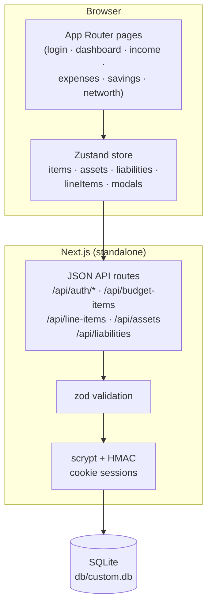

# ZeroBalance — Budget Planner


A production-grade budget planner built around one rule — **Income = Savings + Expenses** — and a self-hosted, superset clone of the reference ZeroBudget app (`zero-balance-4885a8f3.base44.app`), rebuilt as a single Next.js application with cookie-session auth, a Prisma/SQLite store, and a full three-tier test suite.

## Overview

ZeroBalance tracks income, savings, and expenses as budget items, computes your net position against the net-zero goal in real time, and breaks your balance sheet into assets and liabilities for net-worth tracking. The dashboard aggregates everything into allocation percentages, a needs/wants/savings donut, and 50/30/20 guideline rows; every expense category can be decomposed into line items through a built-in calculator that recalculates the category total server-side on every change. The clone keeps pixel-level visual parity with the reference while fixing its two mobile navigation bugs (see [Superset fixes](#superset-fixes-over-the-reference)).

## Key Features

| Feature | Description |
|---------|-------------|
| 🎯 **Net Zero Goal hero** | Forest-gradient dashboard card computing `Income − Savings − Expenses`, allocation %, and Under Budget / NET ZERO / Over Budget status |
| 📊 **Net Zero Breakdown** | Sign-prefixed income/savings/expenses rows (`+ $5,550.00` / `- $1,250.00`) with Net Balance; every row navigates to its view |
| 📈 **Spending Breakdown donut** | recharts pie with the reference's measured palette (Need `#e07a3b`, Want `#3b7ea1`, Savings `#8fbc3f`) and tinted legend rows |
| 🧮 **Category Calculator** | Break any expense category into line items (name, amount, frequency, provider, policy #); each mutation recalculates and persists the parent item's amount server-side, with category-adaptive chrome ("Rent Calculator / Break down your rent…") |
| 💰 **Net Worth tracker** | Assets vs liabilities tabs, gradient summary card with the "∞ : 1" asset-to-liability ratio when debt-free |
| 🔍 **Filterable item views** | Search + category + frequency (+ payment method on expenses) filters; classification/frequency/status badges; inline Edit/Calculate buttons on expense cards |
| 📱 **Working mobile navigation** | Hamburger + slide-in sheet at 288px — with both reference bugs fixed (below) |
| 🔐 **Cookie-session auth** | scrypt password hashing + HMAC-signed sessions, per-IP rate limiting (10 attempts / 15 min), zod-validated API, three-state login card (sign-in / sign-up / forgot) |

### Superset fixes over the reference

The live reference app has two mobile navigation bugs, measured and verified on the clone:

1. **Hamburger click-block** — the reference's empty toast container (`pointer-events: auto`, full-width, top 32px, z-100) covers the top half of the mobile hamburger button. The clone's toast viewport is `pointer-events: none` (the sonner pattern); toasts re-enable pointer events individually.
2. **Menu stays open after nav** — tapping a nav link in the reference's sheet changes the route but leaves the sheet + overlay trapping the user. The clone closes the sheet on every navigation.

Both fixes are pinned by Playwright tests (`tests/e2e/mobile-navigation.spec.ts`).

## Architecture

| Layer | Technology | Version | Purpose |
|-------|-----------|---------|---------|
| Web framework | Next.js (App Router) | ^16.1.1 | Routes, static prerender + standalone build |
| UI runtime | React | ^19.0.0 | Client components, hydrated static pages |
| Language | TypeScript (strict) | ^5 | End-to-end typing, `noEmit` typecheck gate |
| Styling | Tailwind CSS | 4 | CSS-first `@theme`, utility classes + inline CSS-var colors |
| Charts | recharts | ^3.10.1 | Spending Breakdown donut |
| State | Zustand | ^5.0.6 | Single client store (server data + modals), `useShallow` selectors |
| ORM | Prisma | 6.11.1 | Schema, migrations, typed client |
| Database | SQLite | — | `db/custom.db` at the repo root (zero-config) |
| Validation | zod | ^4.6.5 | Every API input, field-level 400s |
| Unit tests | Vitest | ^5.0.1 | Pure domain seams (money, dashboard math, validators) |
| E2E tests | Playwright | ^1.63.0 | Production standalone server, real Chromium |



## File Hierarchy

```
📂 zero-balance/
├── 📂 prisma/
│   └── 📄 schema.prisma           # User, BudgetItem, ExpenseLineItem, Asset, Liability
│   └── 📄 seed.ts                 # Idempotent demo seed (demo@zerobalance.app / Demo1234!)
├── 📂 src/
│   ├── 📂 app/                    # App Router: 7 routes + 15 API handlers
│   │   ├── 📄 login/page.tsx      # Three-state auth card
│   │   └── 📄 [dashboard·income·expenses·savings·networth]/page.tsx
│   ├── 📂 components/
│   │   ├── 📂 budget/             # Views, dialogs, sidebar, store (the app)
│   │   └── 📂 ui/                 # shadcn-style primitives (dialog, select, toast…)
│   └── 📂 lib/                    # Domain seams: money, dashboard, validation,
│                                  #   auth, rate-limit, serializers, db-path
├── 📂 tests/
│   ├── 📄 *.test.ts               # Vitest unit suites (87 tests)
│   └── 📂 e2e/                    # Playwright specs (34 tests) + global setup
├── 📂 scripts/
│   ├── 📄 smoke-test.sh           # 30-step production API smoke test
│   └── 📄 capture-screenshots.mjs # docs/screenshots generator
├── 📄 docs/                       # Tailwind v4 report, SSH push runbook, DEPLOYMENT.md
└── 📄 db/custom.db                # SQLite database (gitignored)
```

## Quick Start

Requires **Node.js ≥ 20** (or bun ≥ 1.2) and npm.

```bash
# 1. install
npm install

# 2. database (SQLite file at db/custom.db — created by the push)
npm run db:push

# 3. seed the demo workspace
npm run db:seed

# 4. dev server → http://localhost:3000
npm run dev
```

**Verify setup**

```bash
curl -s http://localhost:3000/api/health          # {"ok":true,...}
# then log in with the seeded demo account:
#   email: demo@zerobalance.app    password: Demo1234!
```

**Production build**

```bash
npm run build        # standalone output (pins DATABASE_URL for the build)
npm start            # boots .next/standalone/server.js
```

## Environment Variables

`.env` (see `.env.example`; `.env` is gitignored):

| Variable | Required | Description |
|----------|----------|-------------|
| `DATABASE_URL` | yes | `file:../db/custom.db` — **relative to `prisma/schema.prisma`**, not the CWD. `src/lib/db-path.ts` anchors the same rule at runtime so CLI and server agree. |
| `NEXT_PUBLIC_SITE_URL` | no | Canonical public origin for metadata (default `http://localhost:3000`). |
| `AUTH_SECRET` | prod | HMAC key for session cookies. Generate with `openssl rand -hex 32`. Falls back to an insecure dev constant when unset. |

> **Database-location gotcha:** Prisma resolves a relative `file:` URL from a shell-inherited `DATABASE_URL` against the **CWD**, but from a `.env`-loaded value against the **schema dir**. The npm scripts pin `DATABASE_URL` (runtime) and use `env -u` (Prisma CLI) so both always land at `<repo>/db/custom.db`. Don't run bare `prisma db push` from an arbitrary directory.

## Testing

```bash
npm test            # Vitest unit suite (87 tests) — pure domain seams
npm run test:e2e    # Playwright e2e (34 tests) — needs `npm run build` first
bash scripts/smoke-test.sh   # 30-step production API smoke (own server, port 3210)
npm run typecheck   # tsc --noEmit
npm run lint        # eslint (react-hooks v6 rules enforced)
```

- The e2e suite boots the **production standalone server** on `:3100` with its own `db/e2e.db`, deleted and re-seeded **every run** — specs assert the seed's exact arithmetic (e.g. `+$2,065.00` net balance) and restore their fixtures after themselves.
- One worker: the specs share a single seeded SQLite file (`playwright.config.ts`).
- Auth is signed in once by the `setup` project and replayed via storageState — the auth endpoints are rate-limited (10/IP/15 min), so per-test logins would trip the limiter.
- Unit tests cover the money arithmetic (integer-cent sums — no IEEE-754 drift), dashboard aggregations, every zod schema (including empty-string optional dates and impossible calendar dates), the rate limiter, and the SQLite URL resolution contract.

## Design System

Measured from the reference's `:root` (computed styles as ground truth):

| Token | Hex | Usage |
|-------|-----|-------|
| `--forest-dark` | `#1a3a2e` | Headings, active nav text, hero gradient start |
| `--forest-medium` | `#2d5a4a` | Secondary green, active nav gradient start |
| `--lime-green` | `#8fbc3f` | Income accent, primary buttons, avatar |
| `--orange-dark` | `#e07a3b` | Expense accent, "Need" donut slice |
| `--blue-medium` | `#3b7ea1` | Savings accent, "Want" donut slice |
| `--neutral-warm` | `#fafaf8` | Page background |

- **Typography**: the system font stack (`ui-sans-serif, system-ui, …`) — no webfonts.
- **Money**: `$5,500.00` (commas, 2 decimals); savings/expenses rows carry `- ` prefixes, Net Balance `+`.
- **Motion**: sheet slide-in 500ms / slide-out 300ms; `data-[state]`-driven; no reduced-motion needs beyond Radix defaults.
- Tailwind v4 specifics (bare-HSL theme, oklch drift, shadow scale) are pinned in `src/app/globals.css` — the full trap report is [`docs/Tailwind-V4-Validation-Report.md`](docs/Tailwind-V4-Validation-Report.md).

## Deployment

`next build` emits a **standalone** server (`docs/DEPLOYMENT.md` has the full runbook):

```bash
npm run build
DATABASE_URL="file:/absolute/path/to/custom.db" AUTH_SECRET="$(openssl rand -hex 32)" \
  node .next/standalone/server.js
```

Use an **absolute** `file:` URL in production — a relative URL resolves against the standalone build's own location.

## Screenshots

| | |
|---|---|
|  |  |
| *Dashboard — NET ZERO GOAL, breakdown, donut* | *Mobile nav sheet (288px, closes on nav)* |

Full set in [`docs/screenshots/`](docs/screenshots/) — regenerate with `node scripts/capture-screenshots.mjs`.

## Troubleshooting

| Issue | Solution |
|-------|----------|
| `P2003` / `Error code 14` opening the database | A shell-exported absolute `DATABASE_URL` overrides `.env`. Run `npm run db:push` (which strips it) or export `DATABASE_URL="file:../db/custom.db"`. |
| e2e fails with wrong dashboard totals | A previous failed run left fixtures in `db/e2e.db`? The global setup resets it — but specs also restore their own fixtures; if one crashed mid-flow, just re-run. |
| Playwright `--dry-run`/push: `no ssh binary on PATH` | That's the SSH wrapper, not Playwright — see [`docs/how-to-git-push-using-ssh-wrapper_SKILL.md`](docs/how-to-git-push-using-ssh-wrapper_SKILL.md). |
| Login returns 429 in dev | The per-IP rate limiter (10/15 min) persists in the server process. Restart the dev server or wait out the window. |

## License

Private project — all rights reserved.
