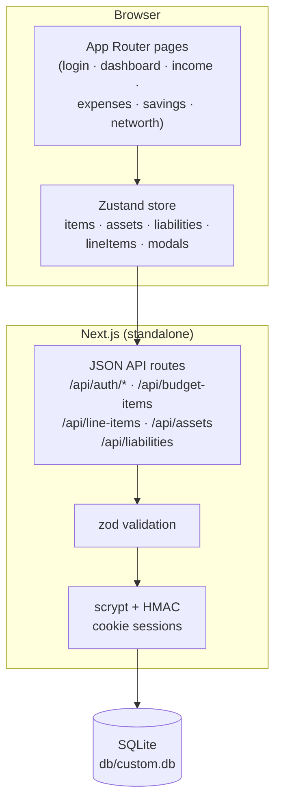
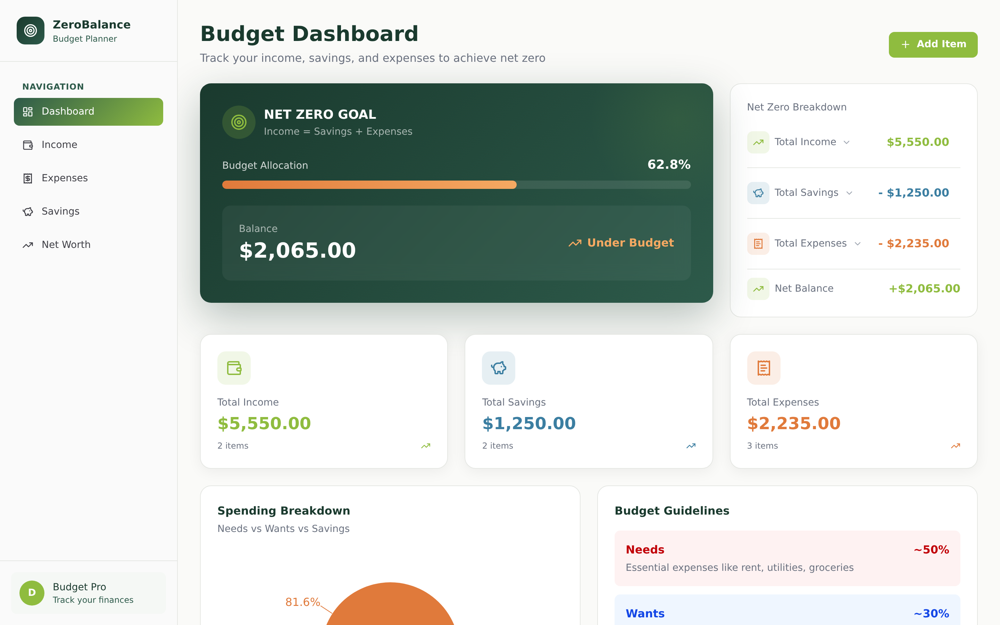
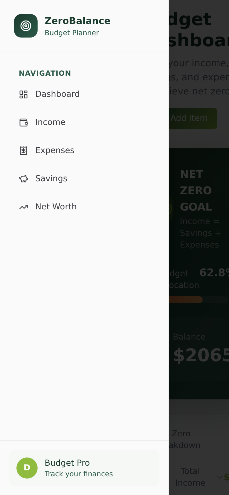
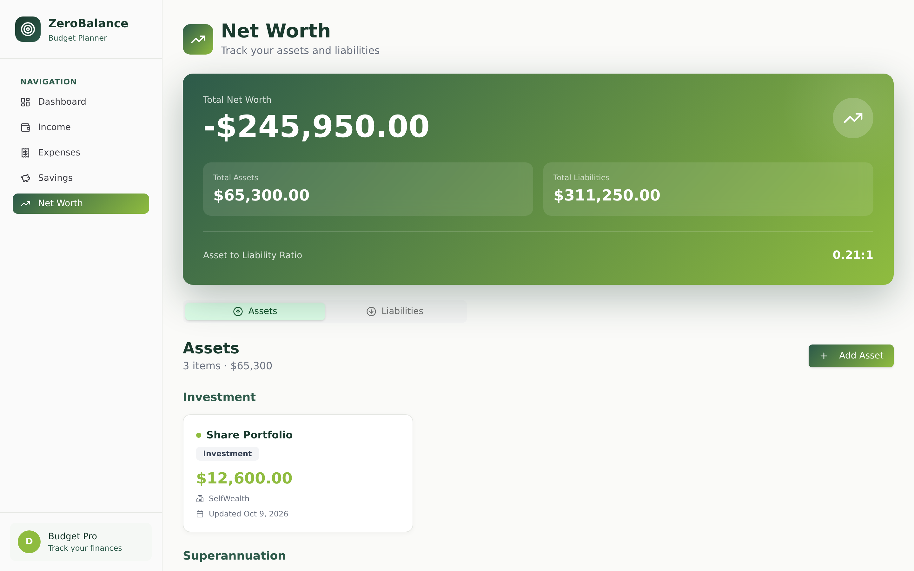
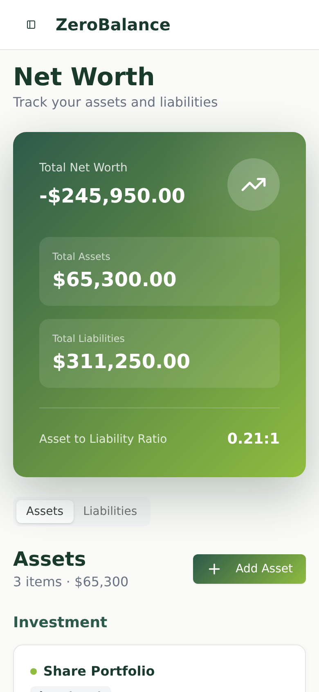

# ZeroBalance — Budget Planner


A production-grade budget planner built around one rule — **Income = Savings + Expenses** — and a self-hosted, superset clone of the reference ZeroBudget app (`zero-balance-4885a8f3.base44.app`), rebuilt as a single Next.js application with cookie-session auth, a Prisma/SQLite store, and a full three-tier test suite.

## Overview

ZeroBalance tracks income, savings, and expenses as budget items, computes your net position against the net-zero goal in real time, and breaks your balance sheet into assets and liabilities for net-worth tracking. The dashboard aggregates everything into allocation percentages, a needs/wants/savings donut, and 50/30/20 guideline rows; every expense category can be decomposed into line items through a built-in calculator that recalculates the category total server-side on every change. The clone keeps pixel-level visual parity with the reference while fixing its two mobile navigation bugs (see [Superset fixes](#superset-fixes-over-the-reference)).

## Key Features

| Feature | Description |
|---------|-------------|
| 🎯 **Net Zero Goal hero** | Forest-gradient dashboard card computing `Income − Savings − Expenses`, allocation %, and Under Budget / NET ZERO / Over Budget status |
| 📊 **Net Zero Breakdown** | A 3-level expandable drill-down (section → category → subcategory → item, accordion-style) with sign-prefixed rows (`$5,550.00` → plain format `- $1250.00`) and a sign-conditional Net Balance (lime/orange/blue) |
| 📈 **Spending Breakdown donut** | recharts pie in the reference's sector order [Savings, Want, Need] (`#8fbc3f` / `#3b7ea1` / `#e07a3b`) with piggy-bank / heart / circle-alert legend icons |
| 🧮 **Category Calculator** | Break any expense category into line items (name, amount, frequency, provider, policy #); each mutation recalculates and persists the parent item's amount server-side, with category-adaptive chrome ("Rent Calculator / Break down your rent…") |
| 💰 **Net Worth tracker** | Assets vs liabilities tabs grouped **by type** under capitalize headers, gradient summary card with the `0.21:1` / `∞:1` asset-to-liability ratio |
| 🔍 **Filterable item views** | Search + category + frequency (+ payment method on expenses) filters; per-classification/per-frequency badge maps, capitalized green Recurring badge; hover-revealed Edit/Calculate buttons on expense cards (plus a superset delete in the edit dialog) |
| 📱 **Working mobile navigation** | Hamburger + slide-in sheet at 288px with the current route highlighted (the reference's forest-gradient active style) — plus both reference bugs fixed (below) |
| 🔐 **Cookie-session auth** | scrypt password hashing + HMAC-signed sessions, per-IP rate limiting (10 attempts / 15 min), zod-validated API, four-state login card (sign-in / sign-up / forgot / verify-email) with the register flow gated behind a 6-digit email-verification code (honest self-hosted delivery — see the v21 plan) |

### Superset fixes over the reference

The live reference app has quirks and bugs, measured against the clone:

1. **Hamburger click-block** — the reference's empty toast container (`pointer-events: auto`, full-width, top 32px, z-100) covers the top half of the mobile hamburger button. The clone's toast viewport is `pointer-events: none` (the sonner pattern); toasts re-enable pointer events individually. Pinned by `tests/e2e/mobile-navigation.spec.ts`.
2. **Menu stays open after nav** — tapping a nav link in the reference's sheet changes the route but leaves the sheet + overlay trapping the user. The clone closes the sheet on every navigation. Pinned by the same spec.
3. **Root URL nav highlight** — the reference marks NO nav item active when you sit on `/` after login (its active check compares the pathname to `/dashboard`). The clone highlights Dashboard on the root route — the page you are actually viewing.
4. **Mobile horizontal overflow** — the reference's own pages scroll sideways on a 390px phone: the dashboard measures 395px and the net-worth page 464px (its fixed `text-5xl` net figure + fixed 2-col summary grid stretch `main` past the viewport). The clone fits exactly (390px) via `min-w-0` on `main` plus a responsive summary card (`text-2xl` on phones, `sm:grid-cols-2`). Pinned by `tests/e2e/mobile-layout.spec.ts` + the net-worth mobile spec.
5. **Dialogs ignore Escape AND outside-click** — the reference's modal overlays are plain `fixed` divs with no keyboard dismissal and no overlay-click dismissal (verified on its budget-item and line-item dialogs: Escape with focus inside and real clicks on the overlay corner both leave it up; only X/Cancel close it). The clone's Radix dialogs close on Escape and overlay click. Pinned by `tests/e2e/dialog-buttons.spec.ts`.
6. **Delete without confirmation** — the reference's card menu Delete destroys the item immediately (verified live — the same for its calculator line-item rows). The clone's delete paths confirm first (the edit dialog's inline confirm / the alert dialog).

The mobile layout itself (top bar stacked inside `main` at the reference's 61px geometry, no horizontal overflow) is pinned by `tests/e2e/mobile-layout.spec.ts`.

## Architecture

| Layer | Technology | Version | Purpose |
|-------|-----------|---------|---------|
| Web framework | Next.js (App Router) | ^16.1.1 | Routes, static prerender + standalone build |
| UI runtime | React | ^19.0.0 | Client components, hydrated static pages |
| Language | TypeScript (strict) | ^5 | End-to-end typing, `noEmit` typecheck gate |
| Styling | Tailwind CSS | 4 | CSS-first `@theme`, utility classes + inline CSS-var colors |
| Charts | recharts | ^3.10.1 | Spending Breakdown donut |
| State | Zustand | ^5.0.6 | Single client store (server data + modals), `useShallow` selectors |
| ORM | Prisma | 6.11.1 | Schema, migrations, typed client |
| Database | SQLite | — | `db/custom.db` at the repo root (zero-config) |
| Validation | zod | ^4.6.5 | Every API input, field-level 400s |
| Unit tests | Vitest | ^5.0.1 | Pure domain seams (money, dashboard math, validators) |
| E2E tests | Playwright | ^1.63.0 | Production standalone server, real Chromium |



## File Hierarchy

```
📂 zero-balance/
├── 📂 prisma/
│   └── 📄 schema.prisma           # User, BudgetItem, ExpenseLineItem, Asset, Liability
│   └── 📄 seed.ts                 # Idempotent demo seed (demo@zerobalance.app / Demo1234!)
├── 📂 src/
│   ├── 📂 app/                    # App Router: 7 routes + 21 API handlers (13 files)
│   │   ├── 📄 login/page.tsx      # Three-state auth card
│   │   └── 📄 [dashboard·income·expenses·savings·networth]/page.tsx
│   ├── 📂 components/
│   │   ├── 📂 budget/             # Views, dialogs, sidebar, store (the app)
│   │   └── 📂 ui/                 # shadcn-style primitives (dialog, select, toast…)
│   └── 📂 lib/                    # Domain seams: money, dashboard, validation,
│                                  #   auth, rate-limit, serializers, db-path
├── 📂 tests/
│   ├── 📄 *.test.ts               # Vitest unit suites (108 tests)
│   └── 📂 e2e/                    # Playwright specs (143 tests) + global setup
├── 📂 scripts/
│   ├── 📄 smoke-test.sh           # 35-step production API smoke test
│   └── 📄 capture-screenshots.mjs # docs/screenshots generator
├── 📄 docs/                       # Tailwind v4 report, SSH push runbook, DEPLOYMENT.md, remediation plan, session log
└── 📄 db/custom.db                # SQLite database (gitignored)
```

## Quick Start

Requires **Node.js ≥ 20** (or bun ≥ 1.2) and npm.

```bash
# 1. install
npm install

# 2. database (SQLite file at db/custom.db — created by the push)
npm run db:push

# 3. seed the demo workspace
npm run db:seed

# 4. dev server → http://localhost:3000
npm run dev
```

**Verify setup**

```bash
curl -s http://localhost:3000/api/health          # {"ok":true,...}
# then log in with the seeded demo account:
#   email: demo@zerobalance.app    password: Demo1234!
```

**Production build**

```bash
npm run build        # standalone output (pins DATABASE_URL for the build)
npm start            # boots .next/standalone/server.js
```

## Environment Variables

`.env` (see `.env.example`; `.env` is gitignored):

| Variable | Required | Description |
|----------|----------|-------------|
| `DATABASE_URL` | yes | `file:../db/custom.db` — **relative to `prisma/schema.prisma`**, not the CWD. `src/lib/db-path.ts` anchors the same rule at runtime so CLI and server agree. |
| `NEXT_PUBLIC_SITE_URL` | no | Canonical public origin for metadata, `sitemap.xml` and `robots.txt` (default `http://localhost:3000`). |
| `AUTH_SECRET` | prod | HMAC key for session cookies. Generate with `openssl rand -hex 32`. Falls back to an insecure dev constant when unset. |

> **Database-location gotcha:** Prisma resolves a relative `file:` URL from a shell-inherited `DATABASE_URL` against the **CWD**, but from a `.env`-loaded value against the **schema dir**. The npm scripts pin `DATABASE_URL` (runtime) and use `env -u` (Prisma CLI) so both always land at `<repo>/db/custom.db`. Don't run bare `prisma db push` from an arbitrary directory.

## Testing

```bash
npm test            # Vitest unit suite (108 tests) — pure domain seams
npm run test:e2e    # Playwright e2e (143 tests) — needs `npm run build` first
bash scripts/smoke-test.sh   # 35-step production API smoke (own server, port 3210)
npm run typecheck   # tsc --noEmit
npm run lint        # eslint (react-hooks v6 rules enforced)
```

- The e2e suite boots the **production standalone server** on `:3100` with its own `db/e2e.db`, deleted and re-seeded **every run** — specs assert the seed's exact arithmetic (e.g. `+$2065.00` net balance) and restore their fixtures after themselves. Close live browser sessions before running it (four agent-browser sessions + Playwright's Chromium exceed the sandbox's memory and crash the run — session-17/19 lesson).
- One worker: the specs share a single seeded SQLite file (`playwright.config.ts`).
- Auth is signed in once by the `setup` project and replayed via storageState — the auth endpoints are rate-limited (10/IP/15 min), so per-test logins would trip the limiter.
- Unit tests cover the money arithmetic (integer-cent sums — no IEEE-754 drift), dashboard aggregations, every zod schema (including empty-string optional dates and impossible calendar dates), the rate limiter, and the SQLite URL resolution contract.

## Design System

Measured from the reference's `:root` (computed styles as ground truth):

| Token | Hex | Usage |
|-------|-----|-------|
| `--forest-dark` | `#1a3a2e` | Headings, active nav text, hero gradient start |
| `--forest-medium` | `#2d5a4a` | Secondary green, active nav gradient start |
| `--lime-green` | `#8fbc3f` | Income accent, primary buttons, avatar |
| `--orange-dark` | `#e07a3b` | Expense accent, "Need" donut slice |
| `--blue-medium` | `#3b7ea1` | Savings accent, "Want" donut slice |
| `--neutral-warm` | `#fafaf8` | Page background |

- **Typography**: the system font stack (`ui-sans-serif, system-ui, …`) — no webfonts.
- **Money — two formatters (measured in the reference bundle)**: plain `"$" + toFixed(2)` without thousands separators on the dashboard / items views / calculator (`$5550.00`); `toLocaleString` grouping on net worth only (`$25,000.00`). Savings/expenses breakdown rows carry `- ` prefixes, Net Balance `+`. Add buttons carry per-surface 135deg gradients (forest→lime, lime→limeLight, blue→blue, orange→orangeLight).
- **Motion**: sheet slide-in 500ms / slide-out 300ms; `data-[state]`-driven; no reduced-motion needs beyond Radix defaults.
- Tailwind v4 specifics (bare-HSL theme, oklch drift, shadow scale) are pinned in `src/app/globals.css` — the full trap report is [`docs/Tailwind-V4-Validation-Report.md`](docs/Tailwind-V4-Validation-Report.md).

## Engineering References

| Document | Purpose |
|----------|---------|
| [`zero-balance_SKILL.md`](zero-balance_SKILL.md) | Distilled engineering skill — design system, architecture, anti-patterns, debugging guide, pre-ship checklist |
| [`docs/remediation-plan.md`](docs/remediation-plan.md) | Session-1/2 findings ledger (reference bugs, Tailwind v4 traps, app bugs) with fixes and regression pins |
| [`docs/remediation-plan-v2.md`](docs/remediation-plan-v2.md) | Session-3 deep parity audit — money format split, drill-down, badge maps, gradients, networth grouping (14 finding groups) |
| [`docs/remediation-plan-v3.md`](docs/remediation-plan-v3.md) | Session-5 parity iteration — mobile top-bar layout bug, filter card, classification tiles, line-item status enum, login states (6 finding groups) |
| [`docs/remediation-plan-v4.md`](docs/remediation-plan-v4.md) | Session-7 parity iteration — nav-link geometry, net-worth summary card + mobile overflow, filter-aware header counts (6 finding groups, 2 new reference bugs) |
| [`docs/remediation-plan-v5.md`](docs/remediation-plan-v5.md) | Session-9 parity iteration — reference-token alignment (neutrals, accent, input, rings), net-worth tab grid + green active state, dialog action buttons (outline Cancel + per-dialog gradient Saves), hover-variant v3 semantics (10 finding groups, 2 new reference bugs R5/R6) |
| [`docs/remediation-plan-v6.md`](docs/remediation-plan-v6.md) | Session-11 parity iteration — plain-text action menus, Save-button icons, asset/liability dialog grid spans + edit-disabled type, reference empty-state pattern (bare icons, no circles), always-visible calculator row actions, padding-outside-max-w content column (14 finding groups + reference bug R7) |
| [`docs/remediation-plan-v7.md`](docs/remediation-plan-v7.md) | Session-13 parity iteration — post-login root redirect, login-surface slate hex pins (lab/oklab drift) + text-sm footer links, logo-ring halo layer, 24px lucide-target + text-lg sidebar brand, 16px near-black mobile toggle icon with shrink-0, sheet border/overlay pins, the custom 404 page, and full head metadata (description/OG/Twitter/canonical/manifest/apple) (8 finding groups) |
| [`docs/remediation-plan-v8.md`](docs/remediation-plan-v8.md) | Session-15 parity iteration — dialog footers rebuilt as the reference's `flex gap-3 pt-4` full-row split (Cancel/Save at flex-1 ≈ 306px each), every remaining badge/nav/Calculate named-palette class hex-pinned (frequency purple/gray/blue/indigo/pink, classification red/blue/green, Recurring green, status slate, zinc-700 nav, orange Calculate) so computed styles render plain rgb instead of v4 lab(), and the stray session-1 `prisma/db/custom.db` binary untracked (2 finding groups + hygiene; Recurring-badge conditional verified live both sides) |
| [`docs/remediation-plan-v9.md`](docs/remediation-plan-v9.md) | Session-17 parity iteration — the donut re-sorted to the reference's value-DESC convention (+ `labelLine={false}`), the dialog X-close rebuilt as the reference's 36×36 in-header button (sticky header 69px), the form labels restored to the inline shadcn-v1 line box (12px label→input gap — v4's space-y margin-block-end is layout-ignored on inline first children, pinned in globals.css), 52px classification tiles, the radio/switch #171717 primitive family, `rounded-full` → `rounded-[9999px]` (24 sites — v4 emits calc(infinity)), and the login card's per-state control geometry (14px button text; 44px sign-up/forgot controls vs 48px sign-in) (7 finding groups) |
| [`docs/remediation-plan-v10.md`](docs/remediation-plan-v10.md) | Session-19 parity iteration — the mobile sheet's active-nav highlighting restored (the reference's sheet renders the current route in the full active style — white + the 135deg forest-medium→lime gradient + fw 500; the clone had suppressed it since session 1 on an unmeasured assumption) — plus the pass's clean sweep: Select popover open state, card action-menu open state, breakdown drill-down expanded rows, guidelines leaves, live focus-visible rings, dialog scroll mechanics, date inputs, and empty-submit behavior all verified identical; the reference's no-toast-on-save behavior documented (the clone's success toasts are superset UX) (1 finding group) |
| [`docs/remediation-plan-v11.md`](docs/remediation-plan-v11.md) | Session-21 parity iteration — the empty-state headings restored to the reference's 20px (`text-xl`), the `.zb-btn-add` gradient-button family re-pinned (v3 bare-shadow ambient on every size, v3 shadow-sm on the outline variant, the shadcn focus-visible ring — white inner + 1px #0a0a0a + transparent outline — replacing the browser default), the Add-button Plus icons 20px→16px (7 sites), and the session-1 hover opacity-0.9 fade removed (the reference has no hover change) — plus the pass's clean sweep: tablet breakpoints 767/768/1024 (rail switch + content offset), rail hover, hero status badge, filter card live behavior + badge census, dialog/sheet/stat-card shadows (read in full), and the no-logout-UI parity all verified identical (4 finding groups) |
| [`docs/remediation-plan-v12.md`](docs/remediation-plan-v12.md) | Session-23 parity iteration — the login ERROR state rebuilt as the reference's red-tinted bordered banner (red-50/70% wash, red-200 border, 12px radius, 16px padding, centered red-700 14px/400 — the shadcn FormMessage pattern; the same slot serves sign-in 401s and sign-up mismatches), the per-route tab titles restored ("Income | ZeroBudget" etc. via route-segment metadata + the root layout's pipe template — a client-side title effect was tried first and REVERTED: React Float re-emits the static <title> after hydration and resets it ~24ms later), the login root promoted to a <main> landmark (tag swap), and the forgot-password flow rebuilt as the reference's confirmation-state layout with honest copy (no mail transport — the toast it replaces pretended nothing either, but the state matches the reference's card structure) (4 finding groups) |
| [`docs/remediation-plan-v13.md`](docs/remediation-plan-v13.md) | Session-25 parity iteration — the register duplicate-email 409 text matched to the reference ("A user with this email already exists"), the sign-up state's password placeholders restored ("Min. 8 characters" / "Re-enter password" — sign-in keeps dots), and the login inputs' FOCUS ring pinned as the reference's two-layer shadcn ring (white 0 0 0 2px + slate-400 0 0 0 4px — v4's color-only ring utility emits no shadow at all) — plus the pass's clean sweep: register banner chrome, login 401 text, item-card date formats, hero progress-bar chrome, the OR divider, the Google button, cursor styles, authed `/login` behavior, the reference's Google-OAuth divergence, and the code audit (npm audit = dev-only unpatchable braces advisory; secret scan clean) all verified/documented (3 finding groups) |
| [`docs/remediation-plan-v14.md`](docs/remediation-plan-v14.md) | Session-27 parity iteration — the donut hover TOOLTIP pinned to the reference (value "$X.XX" via a formatter + the full default-tooltip chrome: #e5e7e3 border, radius 8, 0 4px 12px shadow, black item row — recharts 3 drifts on all four axes), the net-worth tab icons restored (16px lucide circle-arrow-up/down, mr-2, currentColor — active green-900 / inactive gray), and the net-worth page header's 48×48 gradient icon chip (forest→lime, radius 12, white 24px trending-up — measured at BOTH viewports; the items-view chips were pinned in v4, the net-worth page's never was) — found via a VLM three-page screenshot sweep with every flagged diff DOM-verified — plus the pass's clean sweep: net-worth tablist keyboard flow, dialog initial focus (ref: no focus move — the clone's Radix trap is the a11y superset), invalid-input validation (silent both), guideline/accordion hovers, user-select, and the mobile-nav stack re-verified end-to-end (4 finding groups incl. the tooltip chrome) |
| [`docs/remediation-plan-v15.md`](docs/remediation-plan-v15.md) | Session-29 parity iteration — the FULL-PAGE LOADING STATE rebuilt to the reference (the last unmeasured surface class): a DOM-replacing `fixed inset-0` white-backed overlay + the reference's slate spinner (32×32, 4px borders — slate-200 track + slate-800 top spoke, 9999px radius, spin 1s) with NO shell mounted around it, and `boot()` flipping `booted` only after the data lands (the spinner covers the fetch, not just the session probe — the old code flipped it after the session probe and the data popped into empty views) — pinned by 4 new e2e specs using route-delayed API interception; also swept first-time: the Select keyboard flows (the ref is internally inconsistent — its filter selects advance the highlight on ArrowDown-open while its dialog selects highlight the current value; the clone's uniform Radix matches the dialog/a11y pattern), a VLM income/savings/mobile-dashboard sweep (every flag DOM-refuted as data-driven), and the mobile-nav R1–R4 + data-drift re-verification (1 finding group) |
| [`docs/remediation-plan-v16.md`](docs/remediation-plan-v16.md) | Session-31 parity iteration — the boot DATA-failure state measured for the first time: the reference STAYS in-app rendering a silent zero-state when its entity API dies (full shell, hero 0.0% / $0.00 / "✓ NET ZERO", items views "0 items · $0.00" + their standard empty states, NO error surface — a transient network failure looks like an empty budget) while the clone bumped the user to `/login` (boot()'s single catch conflated a data failure with a logged-out session); fixed with a nested try in `boot()` (the user stays, a `bootError` flag drives a one-shot honest error toast — the same superset class as the mutation-failure toasts) and pinned by 3 new e2e specs (route-aborted data APIs + a 401-probe regression pin); also swept first-time: the reference's mutation failure (a SILENT no-op — dialog stays open, no feedback; the clone's dialog + error toast superset verified live) and its no-refetch client-nav under a dead API (in-memory, matching the clone) (1 finding group) |
| [`docs/remediation-plan-v17.md`](docs/remediation-plan-v17.md) | Session-33 parity iteration — the CALCULATOR LINE-ITEM ERROR TIER measured for the first time (the parent-recalc response family the session-32 log flagged next): with the line-items API dead, the reference is SILENT on every path — its calculator load renders the empty-state ("Total Calculated $0.00 / Based on 0 items / No line items yet"), its create leaves the sub-dialog open with no feedback and no optimistic update, its delete leaves the row with no feedback; the clone's mutation-failure superset verified live (create: dialog open + "Could not save the line item" toast; delete: row stays + "Could not remove the line item" toast) but its calculator LOAD failure was swallowed as an unhandled promise rejection (`void loadLineItems(item.id)`) with no honest toast — fixed with a caught effect + the "Could not load the line items" error toast (per-open semantics), rendering unchanged (the reference's empty-state parity via the `?? []` fallback); pinned by 3 new e2e specs (load/create/delete — the mutation pins guard the previously untested catch blocks) (1 finding group) |
| [`docs/remediation-plan-v18.md`](docs/remediation-plan-v18.md) | Session-35 parity iteration — the NET-WORTH ASSET/LIABILITY ERROR TIER measured for the first time (the last unpinned dialog family the session-34 log suggested): the reference is SILENT on both paths with its entity API dead (asset delete → card stays, no confirmation, no feedback; asset save → the dialog stays open, no feedback); the clone's save-failure superset verified live and PINNED ("Could not save the asset" / "Could not save the liability"), while the delete paths swallowed the rejection in THREE files (`void deleteAsset()` / `void deleteLiability()` in net-worth-view, and — found by the post-fix grep sweep — `void deleteItem()` in item-card, the card-menu path the v16 dialog audit missed) — all fixed with caught confirm-bar handlers + the "Could not delete the asset/liability/item" toasts (per-click semantics, surfaces unchanged: the card + confirm bar stay); 5 new e2e specs (asset/liability save/delete under route-aborted APIs + the item-card delete); G2: the register duplicate-email spec's flake root-caused as the Next.js ROUTE ANNOUNCER also rendering role=alert (the old waitForSelector matched the empty announcer, not the 409 banner) — hardened with a text-filtered retrying locator; mobile-nav R1–R4 re-verified + data drift clean (twelfth check) — 96/134/30 green |
| [`docs/remediation-plan-v19.md`](docs/remediation-plan-v19.md) | Session-37 parity iteration — the **VLM VISUAL SWEEP** (the first full-page visual-AI comparison layer, the session-36 log's top suggestion): 12 auth-state pairs + 5 app views + 3 dialogs compared through `z-ai vision` with a mechanical pixel-diff layer — the auth surfaces IDENTICAL ×6 (the v12/v13 text pins held; the logo assets byte-identical by MD5), the app views LAYOUT_IDENTICAL ×5, the dialogs LAYOUT_IDENTICAL except ONE real drift: the item dialog's RECURRING-TOGGLE ROW (the reference runs the switch LEFT with the label right, NO calendar icon, borderless, on a green-tinted rgb(245,248,245) surface — the clone ran icon+label left, switch right, 1px border, transparent) — found by the VLM and DOM-verified on four axes (also DOM-refuted: two VLM hallucinations — the "faded logo" (MD5-identical assets) and the "taller button" (294×44 both)), fixed to the reference's exact arrangement and pinned by a new e2e spec; the calculator's flagged "extra line" refuted as a matching data-conditional (the reference shows the same "• Will update category total" on a non-zero item); tablet breakpoints 767/768/1024 re-measured (visual parity holds — heading x=288 both); mobile-nav R1–R4 re-verified + data drift clean (thirteenth check) — 96/135/30 green |
| [`docs/remediation-plan-v20.md`](docs/remediation-plan-v20.md) | Session-39 parity iteration — the **mobile-app-view + populated-edit-dialog VLM sweep** (the session-38 log's two top suggestions): 5 mobile views at 390×844 + the populated Edit dialog + the breakdown drill-down compared pairwise — the mobile dashboard IDENTICAL, the networth flags all documented superset fix #4 manifestations (plus one tab-tint hallucination refuted: identical rgb(220,252,231) both), and TWO real drifts found and fixed: the ITEMS-VIEW HEADER ROW (base `items-start` missing → the Add button stretched full-width 358px on mobile vs the reference's auto-width 147; `mb-6` vs the reference's `mb-8` → a 24 vs 32px header→filter gap at BOTH viewports — the dashboard's row already carried the correct pattern) and the CLASSIFICATION TILES (the reference's tiles carry 16px lucide icons — circle-alert #e07a3b / heart #3b7ea1 / piggy-bank #8fbc3f — between the radio and the text in BOTH Add and Edit dialog states; the v19 empty-dialog sweep had missed them); both fixed TDD-first and live-re-measured exact; mobile-nav R1–R4 + data drift (fourteenth check) clean; the census probe's base64→atob UTF-8 mangling root-caused (the v19 "mid-pass fix") and fixed transport-safe — 96/137/30 green |
| [`docs/remediation-plan-v21.md`](docs/remediation-plan-v21.md) | Session-41 parity iteration — **SEO + the register verification gate**: the sitemap.xml/robots.txt the reference serves added via Next.js MetadataRoute routes (its five-URL/priority structure mirrored with the clone's routes; `/login` excluded like the reference); the calculator's line-item row actions re-measured HOVER-REVEALED on the live reference (its `opacity-0 group-hover:opacity-100` chrome changed since the v6 pin — the same class as v19's recurring-row drift) and matched, with the `@variant group-hover` pin keeping the reveal alive on hover:none devices; and the REGISTER POST-SUCCESS flow measured for the first time (the reference gates registration behind a "Verify your email" state — 6-digit code inputs, a 5-attempt countdown, Resend semantics, unverified-login rejection) and rebuilt as the honest superset: the full state chrome + `/api/auth/verify-email` + `/api/auth/resend` + a 403 unverified-login rejection + the seeded demo user pre-verified; swept clean: the mobile sheet-open pair, the net-worth populated edit-asset pair (the X-close thrice-DOM-refuted), a keyboard-focus spot check — 108/142/35 green |
| [`docs/remediation-plan-v22.md`](docs/remediation-plan-v22.md) | Session-43 parity iteration — the line-item sub-dialog's THIRD dialog family measured for the first time (the populated Edit state, both viewports): the reference caps its panel at **85vh** (680px desktop / 717px mobile) with form gaps `space-y-5` (20px) — the clone rode the generic budget-item family (90vh + 24px gaps); fixed to the measured family (desktop 672×680, mobile 358×717, form 1002px, gaps 20px — the calculator family stays 85vh/overflow-hidden, the budget-item family stays 90vh/space-y-6, both pinned) — plus the verify-email spec's parked-pointer race root-caused (the Create-account click leaves the pointer on the swapped-in Verify button; its 200ms hover transition read mid-flight — the app was correct, the spec needed the documented park + settle discipline); swept clean: the mobile calculator VLM pair (the row-action "missing" flag = a screenshot mouse-position artifact, DOM-identical both states; the X-close claim refuted a FOURTH time), keyboard Tab sweeps on the dashboard + income views (order + focus chrome identical), mobile-nav R1–R4, the SEO pair live on both sites, data drift (sixteenth check) — 108/143/35 green |
| [`docs/session_1.md`](docs/session_1.md) · [`docs/session_2.md`](docs/session_2.md) · [`docs/session_3.md`](docs/session_3.md) | Narrative logs of the build + re-verification sessions |
| [`worklog.md`](worklog.md) | Rolling project worklog (all sessions, latest first) |
| [`Project_Architecture_Document.md`](Project_Architecture_Document.md) | 7 ADRs, topology, ER diagram, security model |

## Deployment

`next build` emits a **standalone** server (`docs/DEPLOYMENT.md` has the full runbook):

```bash
npm run build
DATABASE_URL="file:/absolute/path/to/custom.db" AUTH_SECRET="$(openssl rand -hex 32)" \
  node .next/standalone/server.js
```

Use an **absolute** `file:` URL in production — a relative URL resolves against the standalone build's own location.

## Screenshots

| | |
|---|---|
|  |  |
| *Dashboard — NET ZERO GOAL, breakdown, donut* | *Mobile nav sheet (288px, closes on nav)* |
|  |  |
| *Net Worth — gradient summary, type-grouped tabs* | *Mobile net worth (fits 390px — superset fix #4)* |

Full 15-shot set in [`docs/screenshots/`](docs/screenshots/) — regenerate with `node scripts/capture-screenshots.mjs`.

## Troubleshooting

| Issue | Solution |
|-------|----------|
| `P2003` / `Error code 14` opening the database | A shell-exported absolute `DATABASE_URL` overrides `.env`. Run `npm run db:push` (which strips it) or export `DATABASE_URL="file:../db/custom.db"`. |
| e2e fails with wrong dashboard totals | A previous failed run left fixtures in `db/e2e.db`? The global setup resets it — but specs also restore their own fixtures; if one crashed mid-flow, just re-run. |
| Playwright `--dry-run`/push: `no ssh binary on PATH` | That's the SSH wrapper, not Playwright — see [`docs/how-to-git-push-using-ssh-wrapper_SKILL.md`](docs/how-to-git-push-using-ssh-wrapper_SKILL.md). |
| Login returns 429 in dev | The per-IP rate limiter (10/15 min) persists in the server process. Restart the dev server or wait out the window. |

## License

Private project — all rights reserved.
